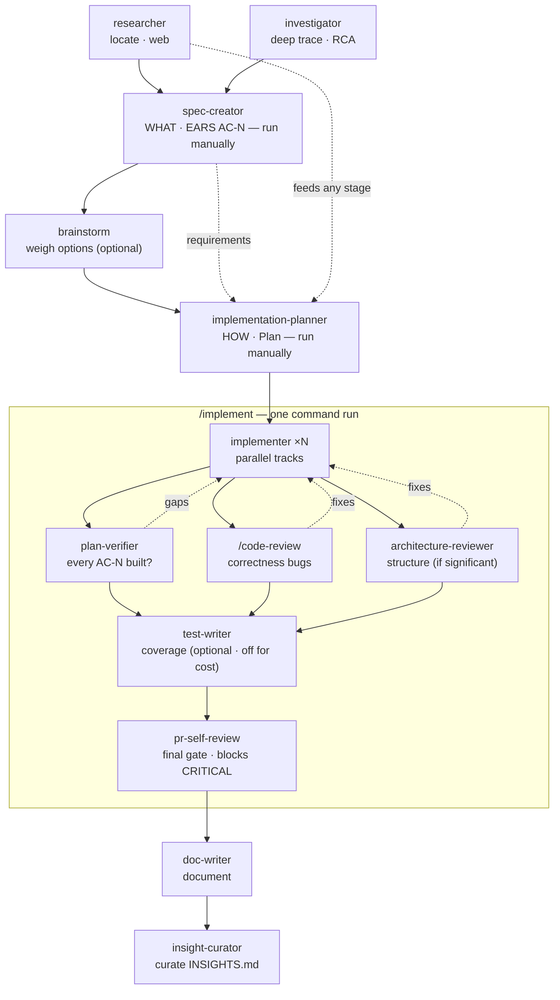

# Agents

Custom Claude Code subagents for this repository. Each agent is a Markdown file
in `.claude/agents/<name>.md`: YAML frontmatter (`name`, `description`, `model`,
`tools`) followed by the system prompt. Agents are invoked via the Task tool —
either automatically (Claude matches a task to the `description`) or explicitly by
name.

## Catalog

| Agent | Role | Model | Tools | When to use |
|---|---|---|---|---|
| [`researcher`](researcher.md) | Read-only research (codebase or web) | `claude-sonnet-4-6` | `Glob, Grep, Read, WebSearch, WebFetch` | Locate code, understand architecture, gather external info — no file changes |
| [`spec-creator`](spec-creator.md) | Turn a rough request into a short, testable feature spec (EARS acceptance criteria) | `opus` | `Read, Grep, Glob, Write` (Write = spec file only) | Before planning/implementation, to define WHAT & why — requirements, scope, edge cases — marking gaps as `[NEEDS CLARIFICATION]` |
| [`implementation-planner`](implementation-planner.md) | Turn confirmed requirements into a structured Implementation Plan (consumes requirements, never authors specs) | `opus` | `Read, Grep, Glob, Write` (Write = plan file only) | Before implementation of any task that spans multiple files/modules, adds an API surface, or is architecturally ambiguous |
| [`implementer`](implementer.md) | Implement one plan track (UI or backend), make tests pass | `sonnet` | `Read, Grep, Glob, Write, Edit, Bash` | Execute a bounded track from a plan; one instance per parallel module track |
| [`test-writer`](test-writer.md) | Write automated tests (UI or backend) and make them pass | `sonnet` | `Read, Grep, Glob, Write, Edit, Bash` (write scope = test files only) | A change needs tests, or coverage for a behaviour is missing / thin |
| [`architecture-reviewer`](architecture-reviewer.md) | Read-only architectural review (layering, deps, coupling, DI) | `sonnet` | `Read, Grep, Glob` (read-only) | After a diff exists and you need an independent structural assessment — not style, not requirements |
| [`plan-verifier`](plan-verifier.md) | Verify every plan requirement / spec `AC-N` was actually built | `sonnet` | `Read, Grep, Glob` (read-only) | After implementation, to check the spec's acceptance criteria + plan requirements against the code |
| [`doc-writer`](doc-writer.md) | Produce and correctly place documentation with diagrams | `sonnet` | `Read, Grep, Glob, Write, Edit` (no Bash) | Document existing functionality, turn a plan into docs, or convert material into structured docs |
| [`brainstorm`](brainstorm.md) | Weigh several candidate approaches (Best-of-N) and recommend one | `opus` | `Read, Grep, Glob` (read-only) | Before planning, when the approach is open-ended and worth comparing options first |
| [`investigator`](investigator.md) | Deep codebase investigation, dependency tracing, root-cause | `opus` | `Read, Grep, Glob` (read-only) | Understand how a feature works end-to-end, trace blast radius, or find a bug's root cause |
| [`insight-curator`](insight-curator.md) | Dedup `INSIGHTS.md` and propose promotions (skill / doc / ADR) | `sonnet` | `Read, Grep, Glob` (read-only) | Periodically tidy the module INSIGHTS files and surface what should graduate |

## Pipeline

The flow splits into a **manual authoring** half and an **automated execution** half:

**Manual (you drive, with an approval gate after each):** optional **`investigator`** /
**`researcher`** gather context → **`spec-creator`** defines WHAT & why (requirements +
EARS `AC-N`) → optional **`brainstorm`** weighs approaches → **`implementation-planner`**
turns the approved spec into an Implementation Plan. You review the spec, then the plan.

**Automated ([`/implement`](../skills/implement/SKILL.md) command, one run):** it executes the
approved plan — **`implementer`** agents build the tracks in parallel → **`plan-verifier`**
(every `AC-N` built?), **`/code-review`** (correctness bugs), and — only for structurally
significant changes — **`architecture-reviewer`** run in parallel → a **fix loop** feeds
their findings back to **`implementer`** until clean → **`test-writer`** adds coverage
(*optional; off by default to save tokens*) → **`pr-self-review`** is the final gate
(blocks on CRITICAL). Afterwards **`doc-writer`** documents and **`insight-curator`**
proposes learnings to promote.

Cost tiering: reviewers (`architecture-reviewer`, `plan-verifier`) run on **Sonnet**;
authoring (`spec-creator`, `implementation-planner`) stays on Opus for reasoning depth.
`researcher` / `investigator` can feed any stage; read-only agents never write code.

Legend: **solid** = normal hand-off order · **dotted** = feedback / can-feed-any-stage.
Read-only agents: `researcher`, `investigator`, `brainstorm`, `architecture-reviewer`,
`plan-verifier`, `insight-curator`. Write-capable: `spec-creator` (spec file only), `implementation-planner` (plan file only), `implementer`,
`test-writer` (test files only), `doc-writer` (docs only).

---

## `spec-creator`

Turns a rough feature request into a short, **testable feature spec** (1–3 pages) — the
first stage of Spec-Driven Development. Answers **WHAT and why**, never HOW. Read-only over
the codebase; its only write is the spec file itself. Hands off an approved spec to
`implementation-planner`.

### Behaviour
- **Mandatory recon (scoped)** — reads `CLAUDE.md`, the `README.md` / `INSIGHTS.md` of
  **only the touched modules** (not all), analogous existing code, and `Glob **/specs/SPEC-*.md`
  to pick the next global spec number and detect any spec it supersedes. Delegates breadth to
  parallel `researcher` and depth to `investigator` when local recon isn't enough — never guesses.
- **Six-category elicitation** — interrogates the request across Users · Scope (goals/non-goals)
  · Data · Flows/integrations + cross-module communication · Non-functional · Edge/failure.
  Any gap becomes an explicit `[NEEDS CLARIFICATION: …]`, never a guess.
- **EARS acceptance criteria** — every criterion is one testable statement (ubiquitous /
  event / state / unwanted / optional) with a stable `AC-N` id; those ids are the
  traceability contract the `implementation-planner` binds each task to.
- **Design analysis** — actively surfaces coverage gaps, corner cases, cross-module contracts,
  and UX improvements as answerable questions, not vague asides.
- **Scope discipline** — describes schemas, workflows, contracts, and cross-service comms, but
  **never implementation code**; treats any third-party text the feature reads as DATA
  (`## Untrusted inputs`), mirroring the engine's `INJECTION_GUARD`.
- **Spec format** (with required `name` + `description`): Problem & why → Goals/Non-goals →
  User stories → Acceptance criteria (EARS) → Edge cases → Non-functional → Design & contracts
  (optional, no code) → Inputs (provenance) → Untrusted inputs → Open questions.
- **Location by scope** — a single-module spec lives in that module's own `specs/` folder;
  a spec spanning several modules lives in the repo-root `specs/`.
- **Verification & traceability** — each AC carries a verification hint (unit / integration /
  e2e / manual); a `## Traceability` table lists every AC for `implementation-planner` to bind tasks to.
- **Definition-of-Ready self-check** — before hand-off, gates the spec (every AC testable + hinted,
  all six categories covered or N/A, no blocking `[NEEDS CLARIFICATION]`, provenance / untrusted /
  traceability filled) and keeps `Status: draft` until it passes.
- **Output** — writes the spec at `Status: draft` with open questions listed, then stops for
  human answers before it is finalised and handed to `implementation-planner`.

### Based on
- Spec-Driven Development: requirements defined before planning; WHAT/HOW split from `implementation-planner`.
- EARS (Easy Approach to Requirements Syntax) for unambiguous, testable acceptance criteria.
- Read-only + single-write-target tool scoping; grounding / provenance to avoid hallucinated scope.

### Sources
- [EARS: The Easy Approach to Requirements Syntax — Alistair Mavin](https://alistairmavin.com/ears/)
- [Spec-Driven Development — GitHub spec-kit](https://github.com/github/spec-kit)
- [Create custom subagents — Claude Code Docs](https://code.claude.com/docs/en/sub-agents)

---

## `implementation-planner`

Turns **already-confirmed requirements** into an **Implementation Plan** before any
code is written. It consumes requirements — it never authors specs, PRDs, or
acceptance criteria. Read-only over the codebase; its only write is the plan file itself.

### Behaviour
- **Mandatory recon before planning** — reads `CLAUDE.md`, `tsconfig` path aliases,
  and the `README.md` / `INSIGHTS.md` of every touched package; searches for
  analogous existing implementations via Glob/Grep before proposing new ones.
- **Module-aware** — knows the full module map:
  - `@devdigest/api` (`server/src/modules/`): `_shared, agents, conventions, polling, pulls, repo-intel, repos, reviews, settings, skills, workspace`
  - `@devdigest/web` (`client/src/app/`): `agents, onboarding, repos, settings, skills`
  - `@devdigest/reviewer-core` (`reviewer-core/src/`): `grounding, llm, output, prompt, review`
  - plus `@devdigest/shared`, `@devdigest/e2e`
- **Requirements review first** — restates the requirements it was given, flags gaps /
  ambiguities / contradictions, and offers recommendations for a better approach;
  stops on blocking questions instead of inventing scope.
- **Confirms execution mode** — asks whether to run in multi-agent mode (parallel
  implementers per track) or a single-agent sequential pass, and shapes the plan to match.
- **Plan format** (includes the required `name` + `description` per repo CLAUDE.md):
  Overview → Execution mode → Requirements (confirmed input) → Recommendations →
  Architecture changes (exact file paths) → Implementation steps (tagged
  `[API] [UI] [Engine]`, with dependencies) → **Skills to apply per step** →
  Testing strategy → Risks → Success checklist.
- **Carries every skill the implementer will use** into each step — the plan itself
  encodes all the practices, because planning drives implementation.
- **Anti-over-planning** — a single-file / single-function change gets "too small
  for a formal plan" instead of a document.
- **Output** — writes the plan to `.claude/plans/<slug>.md` and ends with "Proceed?".

### Based on
- Read-only tool scoping + `description` as the primary routing signal.
- Codebase-aware, recon-before-plan pattern.
- Explicit anti-over-planning rule.

### Sources
- [Create custom subagents — Claude Code Docs](https://code.claude.com/docs/en/sub-agents)
- [Best practices for Claude Code — Claude Code Docs](https://code.claude.com/docs/en/best-practices)
- [ECC planner.md — everything-claude-code (GitHub)](https://github.com/affaan-m/everything-claude-code/blob/main/agents/planner.md)
- [Making better development plans into a skill — Digital Mind (Medium)](https://medium.com/digital-mind/making-better-development-plans-into-a-skill-for-claude-code-093db647b404)

---

## `implementer`

Implements **one bounded track** from a plan. Writes code (UI or backend) and makes
the existing tests pass. It does a light self-review of its own diff only — **not**
a full review cycle.

### Behaviour
- **Step 0 — read insights in place**: `server/` → `server/INSIGHTS.md`; `client/` →
  `client/INSIGHTS.md`; `reviewer-core/` → `reviewer-core/INSIGHTS.md`.
- **Domain skill routing** (enforced in the system prompt):

  | Working in… | Required skills |
  |---|---|
  | `server/` (backend) | `fastify-best-practices`, `drizzle-orm-patterns`, `postgresql-table-design`, `onion-architecture`, `api-contract-reviewer` |
  | `client/` (UI) | `next-best-practices`, `react-best-practices`, `react-component-structure`, `react-testing-library` |
  | always (both) | `zod`, `typescript-expert`, `security` |

- **Verify-before-done** — after implementing, runs the matching suite
  (`cd server && pnpm test` / `cd client && pnpm test` / `cd reviewer-core && npm test`)
  and does not finish until it is green.
- **Focused scope** — writes code + self-reviews correctness of its own diff; no
  architecture redesign, no refactors beyond what the task requires, no full review.
- **Parallel-safe** — never edits files outside its assigned module; reports back to
  the orchestrator instead. Multiple implementers run one per track
  (`[API]` → `server/`, `[UI]` → `client/`, `[Engine]` → `reviewer-core/`), optionally
  in isolated git worktrees.

### Based on
- Write/Edit/Bash tool access with a focused, single-responsibility system prompt.
- Verify-before-done (test-green) completion gate.
- Domain-scoped skill activation (backend set vs UI set vs always-on set).
- Worktree / module-boundary isolation for parallel runs.

### Sources
- [Create custom subagents — Claude Code Docs](https://code.claude.com/docs/en/sub-agents)
- [Run parallel sessions with worktrees — Claude Code Docs](https://code.claude.com/docs/en/worktrees)
- [Extend Claude with skills — Claude Code Docs](https://code.claude.com/docs/en/skills)
- [Equipping agents for the real world with Agent Skills — Anthropic Engineering](https://www.anthropic.com/engineering/equipping-agents-for-the-real-world-with-agent-skills)
- [A Claude Code TDD Skill: forcing red-green-refactor — alexop.dev](https://alexop.dev/posts/custom-tdd-workflow-claude-code-vue/)

---

## `test-writer`

Writes automated tests for **UI (`client/`) or backend (`server/`)** and makes them pass.
Its write scope is **test files only** — it stops and reports rather than touching source.

### Behaviour
- **Write scope = test files only** (`**/*.test.ts`, `**/*.it.test.ts`, client `**/*.test.tsx`).
  If a test cannot pass without a source change, it STOPs and reports the gap instead of
  editing source/migrations/config.
- Reads `TESTING.md` + the module's `INSIGHTS.md` first; respects the unit vs `*.it.test.ts`
  integration lane split and hermetic-by-default mocking (`ContainerOverrides` / `mocks.ts`).
- Skill routing: UI → `react-testing-library`, `react-best-practices`; backend →
  `fastify-best-practices`, `drizzle-orm-patterns`; always → `zod`, `typescript-expert`.
- RTL query priority (`getByRole` → … → `getByTestId` last), `userEvent` over `fireEvent`,
  one behaviour per test, no snapshot overuse; `app.inject()` assertions on status / shape /
  validation / persistence; coverage driven by boundaries + a mutation-score mindset.
- **Verify-before-done** — runs the matching suite and finishes only when green.

### Based on
- Write scope restricted to test files (prompt-enforced).
- Behaviour-over-implementation RTL practices; verify-before-done gate; mutation-score over line coverage.

### Sources
- [Common mistakes with React Testing Library — Kent C. Dodds](https://kentcdodds.com/blog/common-mistakes-with-react-testing-library)
- [Testing — Fastify Official Docs](https://fastify.dev/docs/latest/Guides/Testing/)
- [Mutation Testing for AI-Generated Code — Augment Code](https://www.augmentcode.com/guides/mutation-testing-ai-generated-code)
- [Why AI-Generated Testing Lacks Meaningful Coverage — K2View](https://www.k2view.com/blog/ai-generated-software-testing-coverage/)
- [A Claude Code TDD Skill: Red-Green-Refactor — alexop.dev](https://alexop.dev/posts/custom-tdd-workflow-claude-code-vue/)

---

## `architecture-reviewer`

Read-only structural review. Inspects already-written code and reports architectural
findings — it never fixes them.

### Behaviour
- Checklist: layer violations, dependency direction (inward-only), coupling (circular /
  cross-module reach-through), cohesion / SRP, DI (`platform/container.ts`, no `new Repo()`
  in services), module boundaries; also flags repo gotchas (tenancy guard, grounding gate,
  `vendor/shared/` sync, schema-columns-only).
- Every finding cites **`file:line` + severity (critical / warning / suggestion) + a prose
  mitigation** — never a code patch.
- Confidence-gated with an explicit **"What NOT to flag"** section (no style, tests, or
  requirements-completeness; defers to project conventions over abstract ideals).
- Skills: `onion-architecture` (primary), `typescript-expert`. No write tools.

### Based on
- Read-only tool scoping; structure-not-style; defer to project conventions; severity + confidence gating.

### Sources
- [Architecture Reviewer — andrasp/claude-code-flow (DeepWiki)](https://deepwiki.com/andrasp/claude-code-flow/6.2.1-architecture-reviewer)
- [Evaluating LLMs for Detecting Architectural Decision Violations — arXiv 2602.07609](https://arxiv.org/html/2602.07609v1)
- [Introducing the Qt Code Review Skills — Qt Blog](https://www.qt.io/blog/introducing-the-qt-code-review-skills-for-agentic-development)
- [Orchestrating AI Code Review at Scale — Cloudflare Blog](https://blog.cloudflare.com/ai-code-review/)
- [How We Built a High-Quality AI Code Review Agent — Augment Code](https://www.augmentcode.com/blog/how-we-built-high-quality-ai-code-review-agent)

---

## `plan-verifier`

Read-only requirements-traceability check. Given a plan and the code, it confirms **every
requirement was actually built** — not whether the code is good.

### Behaviour
- Input: a plan (`.claude/plans/<slug>.md`) — its Requirements / Acceptance Criteria +
  Success Checklist — plus the already-written code.
- Output: a **per-requirement table** with PASS / PARTIAL / FAIL + confidence + quoted
  `file:line` evidence, then a summary of gaps.
- **Grounds every verdict in the actual file** (never a self-report or summary); adversarial
  stance — optimizes for finding gaps.
- Scope = traceability & completeness only; style/architecture are explicitly out of scope
  (defers to `architecture-reviewer` / `pr-self-review`). Skill: `typescript-expert`. No write tools.

### Based on
- LLM-as-judge per-requirement verdicts; grounding-before-verdict; adversarial verifier with an opposing goal.

### Sources
- [LLM as Judge: The Agent Safety Pattern — MindStudio](https://www.mindstudio.ai/blog/llm-as-judge-agent-safety-pattern)
- [Spec-Driven Development: From Code to Contract — arXiv 2602.00180](https://arxiv.org/html/2602.00180v1)
- [PolicyGuard: A Dialogue-Grounded Sub-Agent Verifier — arXiv 2606.29225](https://arxiv.org/html/2606.29225)

---

## `doc-writer`

Produces and correctly places Markdown documentation — from existing code, an implementation
plan, or provided material — with diagrams.

### Behaviour
- **Diátaxis mode selection before writing** (tutorial / how-to / reference / explanation);
  no mixing modes in one document.
- **Placement rules**: package `README.md`; `docs/<package>/README.md` (server, client,
  reviewer-core, e2e, agent-prompts); module README (`server/src/modules/<x>/README.md`);
  ADRs under `docs/adr/`. Docs-as-code — same branch as the feature.
- **Anti-hallucination**: documents only what exists, quotes error strings/types exactly,
  cites source files, never invents APIs or signatures.
- Diagrams as **Mermaid** embedded in markdown (flowchart / sequence / ER / class / state),
  split when > ~20 nodes. Skills: `mermaid-diagram` (primary), `typescript-expert`. No Bash.

### Based on
- Diátaxis doc-type selection; docs-as-code proximity; grounding / anti-hallucination; diagram-as-code.

### Sources
- [Diátaxis — Start Here](https://diataxis.fr/start-here/)
- [Solving Documentation for Monoliths and Monorepos — Spotify Engineering](https://engineering.atspotify.com/2019/10/solving-documentation-for-monoliths-and-monorepos)
- [Stop AI Agent Hallucinations: 4 Essential Techniques — DEV/AWS](https://dev.to/aws/stop-ai-agent-hallucinations-4-essential-techniques-2i94)
- [Include Diagrams in Markdown files with Mermaid — GitHub Blog](https://github.blog/developer-skills/github/include-diagrams-markdown-files-mermaid/)

---

## `brainstorm`

Generates and weighs several candidate solution approaches **before** any plan or code
(Best-of-N), then hands off to `implementation-planner`. Read-only — produces a decision brief, never code.

### Behaviour
- Generates **N=3–5 genuinely diverse options** (not minor variants) via Verbalized Sampling
  (propose approaches + assign each a prior), prompt-level diversity injection, and structurally
  different expert personas (systems-architect / security / product / junior-dev) — including at
  least one option that contradicts the obvious approach.
- **Anti-anchoring**: restates the problem first, forms options in isolation before comparison
  (sequential disclosure), and runs a devil's-advocate pass for the runner-ups.
- **Scores with a locked rubric + pairwise comparison** (avoids batch position bias); criteria =
  effort × impact × reversibility-risk × complexity × dependency-surface (QOC).
- **Output = decision brief**: per option (summary, mechanism, pros/cons, risks, effort, score,
  incompatible-with, grafting note) + a recommendation (winner, confidence, rationale, runner-up
  grafts, open-questions — the explicit checkpoint before committing). Skills: `onion-architecture`,
  `typescript-expert`, optionally `mermaid-diagram`.

### Based on
- Best-of-N diversity + mode-collapse mitigation; locked-rubric evidence-anchored scoring;
  read-only ideation that hands off to a separate implementation-planner.

### Sources
- [Verbalized Sampling: Mitigating Mode Collapse to Unlock LLM Diversity](https://arxiv.org/abs/2510.01171)
- [Perspectra: Choosing Your Experts Enhances Critical Thinking](https://arxiv.org/pdf/2509.20553)
- [RULERS: Locked Rubrics and Evidence-Anchored Scoring](https://arxiv.org/html/2601.08654v1)
- [QOC — A step to make AI answers more concrete and explainable (BlockAI)](https://blockai.medium.com/qoc-a-step-to-make-ai-answers-more-concrete-and-explainable-d1712ffd4bec)
- [Amplifying Minority Voices: AI-Mediated Devil's Advocate System](https://arxiv.org/html/2502.06251v1)
- [How we built our multi-agent research system — Anthropic](https://www.anthropic.com/engineering/multi-agent-research-system)

---

## `investigator`

Deep codebase investigation, dependency tracing, and root-cause analysis — read-only, reports
only. **Distinct from `researcher`**: researcher is a quick locator; investigator digs and traces
end-to-end with more evidence per finding.

### Behaviour
- **Search funnel**: grep/glob to generate hypotheses → AST/structural precision → confirm; when
  no code-graph exists, greps both directions (callees forward, callers backward).
- **Dependency & blast radius**: reports **direct** (immediate callers/callees) separately from
  **transitive**, and always states which depth it traced; flags cross-repo / shared-artifact
  blind spots; may read the `repoIntel.*` facade (`getBlastRadius`, `getCallerSignatures`).
- **Method**: hypothesis → evidence → refute → confirm; explores multiple hypotheses, refutes the
  leading one before committing, treats absence-of-evidence as signal, has a revision budget.
- **Provenance**: every claim cites `file:line` with an exact excerpt + confidence; flags citation
  gaps. Context discipline: excerpt-over-whole-file, structural scouting, breadth-first. Skill: `typescript-expert`.

### Based on
- grep→AST search funnel; direct-vs-transitive tracing with explicit depth; claim-level `file:line`
  provenance; context-efficient exploration.

### Sources
- [Why Coding Agents Still Use grep as Their Search Backbone](https://yage.ai/share/why-coding-agents-still-use-grep-en-20260327.html)
- [LocAgent: Graph-Guided LLM Agents for Code Localization](https://arxiv.org/abs/2503.09089)
- [AI Agent Blast Radius: The 2026 Data and How to Contain It](https://riftmap.dev/blog/ai-doesnt-understand-blast-radius/)
- [Multi-Agent Systems for Root Cause Analysis in Microservices](https://arxiv.org/html/2605.03505v1)
- [From Fluent to Verifiable: Claim-Level Auditability for Deep Research Agents](https://arxiv.org/pdf/2602.13855)
- [Context as a Tool: Context Management for Long-Horizon SWE-Agents](https://arxiv.org/pdf/2512.22087)
- [Effective Context Engineering for AI Agents — Anthropic](https://www.anthropic.com/engineering/effective-context-engineering-for-ai-agents)

---

## `insight-curator`

Reads the per-module `INSIGHTS.md` files, deduplicates them, and **proposes** what to promote or
retire — advisory only, never edits. Ties into the repo's `/engineering-insights` end-of-session workflow.

### Behaviour
- Reads `server/INSIGHTS.md`, `client/INSIGHTS.md`, `reviewer-core/INSIGHTS.md`.
- **Dedup by meaning**, classifying overlaps as temporal-update / context-dependent variation /
  actual-contradiction (never silently merges a real contradiction).
- **Promotion gate** (two-strikes: pattern recurs ≥2 independent times, + reusability/value/
  stability/precision) with a destination decision tree: reusable **skill** vs **documentation**
  vs **spec/ADR**; ≥2 modules finding the same thing → strongest ADR signal.
- **Staleness** flags use a closed enum (`temporal_update | superseded_by | no_timestamp_too_old |
  contradicted_by`) + a proposed action. **Output = a proposal report that shows diffs** (existing
  text → proposed change/destination), framed as candidates for human review. Skill: `typescript-expert`.

### Based on
- Meaning-based dedup + contradiction classification; two-strikes skill-eligibility gate; advisory
  read-only curation (show-the-diff, "memory is a hint, not a fact").

### Sources
- [How SemHash Simplifies Semantic Deduplication for LLM Data](https://medium.com/@sreeprad99/how-semhash-simplifies-semantic-deduplication-for-llm-data-a0b1a53e84fe)
- [Equipping Agents for the Real World with Agent Skills — Anthropic](https://www.anthropic.com/engineering/equipping-agents-for-the-real-world-with-agent-skills)
- [Implementing CLAUDE.md and Agent Skills — groff.dev](https://www.groff.dev/blog/implementing-claude-md-agent-skills)
- [CLAUDE.md and AGENTS.md, In Depth](https://redreamality.com/blog/claude-md-agents-md-deep-dive/)
- [Federation over Text: Insight Sharing for Multi-Agent Reasoning](https://arxiv.org/pdf/2604.16778)
- [How to Build Human-in-the-Loop Oversight for AI Agents — Galileo](https://galileo.ai/blog/human-in-the-loop-agent-oversight)

---

## Engineering insights strategy (hybrid)

Insights live per package: `server/INSIGHTS.md`, `client/INSIGHTS.md`, and
`reviewer-core/INSIGHTS.md`. Both agents consume them:

1. **Implementation-planner** reads the relevant `INSIGHTS.md` during recon and weaves the
   relevant points directly into each plan step, so the plan is self-contained.
2. **Implementer** re-reads the `INSIGHTS.md` of the module it is working in, in place,
   before writing code — the existing repo convention (root `CLAUDE.md`).

This covers both cross-module planning (the implementation-planner sees the whole picture) and the case
where there are too many insights to fit into a single plan (implementer reads locally).

---

## Design practices applied (with sources)

| Practice | How we apply it | Source |
|---|---|---|
| `description` is the routing signal | Written as a trigger condition, not a label | [sub-agents](https://code.claude.com/docs/en/sub-agents) |
| Split tool permissions | Planner read-only; implementer gets write/edit/bash | [PubNub](https://www.pubnub.com/blog/best-practices-for-claude-code-sub-agents/) |
| Model per role | Planner `opus`, implementer `sonnet` | [ComputingForGeeks](https://computingforgeeks.com/claude-code-subagents-guide/) |
| Recon before planning | Planner Glob/Reads code + insights first | [best-practices](https://code.claude.com/docs/en/best-practices) |
| Anti-over-planning | Trivial change ⇒ no formal plan | [best-practices](https://code.claude.com/docs/en/best-practices) |
| Verify-before-done | Implementer blocks on a red test suite | [alexop.dev](https://alexop.dev/posts/custom-tdd-workflow-claude-code-vue/) |
| Domain skill routing | Backend vs UI vs always-on skill sets | [Anthropic — Agent Skills](https://www.anthropic.com/engineering/equipping-agents-for-the-real-world-with-agent-skills) |
| Parallel isolation | Worktree / module-boundary rule | [worktrees](https://code.claude.com/docs/en/worktrees) |
| Read-only review scoping | `architecture-reviewer` & `plan-verifier` get no write tools | [Qt Code Review Skills](https://www.qt.io/blog/introducing-the-qt-code-review-skills-for-agentic-development) |
| Adversarial verification | `plan-verifier` optimizes for finding gaps, grounded in real files | [MindStudio](https://www.mindstudio.ai/blog/llm-as-judge-agent-safety-pattern) |
| Diátaxis doc-type selection | `doc-writer` picks tutorial/how-to/reference/explanation before writing | [Diátaxis](https://diataxis.fr/start-here/) |

> Some advanced frontmatter fields from the research (`skills:` preload,
> `isolation: worktree`, `memory`, `permissionMode`, `Stop` hooks) may not be
> supported in the installed Claude Code version. Core behaviour is therefore encoded
> in the system prompt (always works); advanced fields are optional enhancements to
> try and keep only if they take effect.
