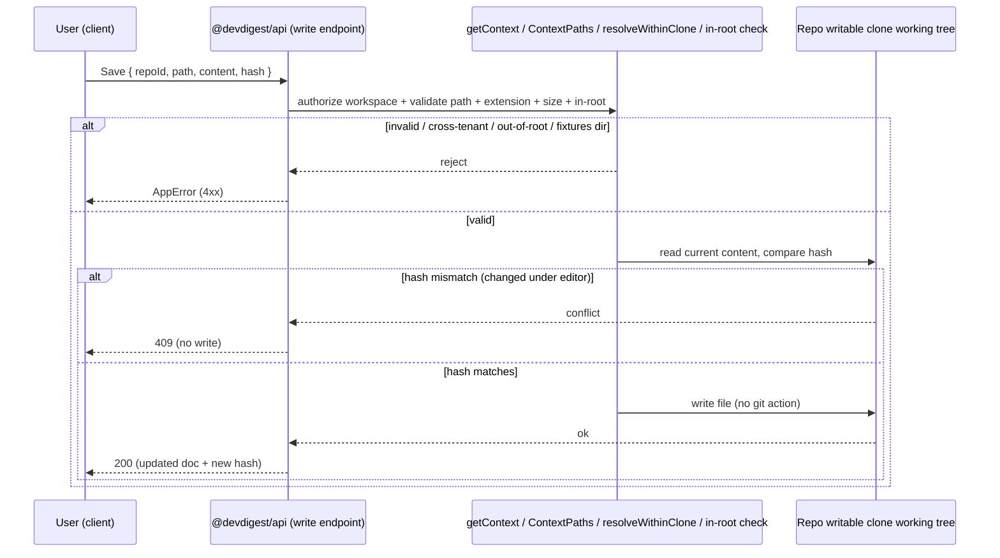

# Spec: Project Context — editing & toolbar  |  Spec ID: SPEC-02  |  Status: approved
Supersedes: `specs/SPEC-01-project-context-folder.md` — specifically SPEC-01's
**read/preview-only** decision (Non-goal + Decision **D-7**) and its guarding client
test in `ProjectContextView.test.tsx` ("does not render an upload/edit toolbar
(read/preview only)"), which SPEC-02 relaxes. SPEC-01's other ACs remain in force. The
implementer must update that guard test (AC-15). See Decision **D-10** for a naming
caveat (the request refers to this as "AC-13", but SPEC-01's literal `AC-13` is the
un-cloned/degraded-state criterion; the read/preview-only constraint is D-7 + Non-goal +
the client test). Recommend the human flip SPEC-01's Status to reflect the partial
supersede once SPEC-02 is approved.

## Problem & why
SPEC-01 shipped the Project Context screen as **read + preview only** and explicitly
deferred authoring because writing repo markdown is non-trivial. The design mockup,
however, shows an authoring surface: a top toolbar (new doc, new folder, upload, refresh,
open, current root path) and a right-pane **Preview | Edit** toggle with a **Save**. This
spec closes that gap. To keep v1 small and safe, writes land **only in the repo clone's
working tree on disk** (no git commit/push/PR), and the seeded demo repo is given a
**writable copy** of the committed fixtures so authoring never mutates repo source under
`server/src/db/`.

## Goals / Non-goals
- **Goals:**
  - Add a **top toolbar** above the doc list with: **New doc (+)**, **New folder**,
    **Upload**, **Refresh**, an **Open** affordance, and a display of the active root
    path (e.g. `.devdigest/specs/`).
  - Add a right-pane **Preview | Edit** toggle: Preview keeps the existing `react-markdown`
    rendering; **Edit** shows the doc's **raw markdown** in an editable editor with **Save**.
  - Add tenancy-scoped, Zod-validated, traversal-guarded **server write endpoints** for
    create/update doc, upload, and new folder — reusing the SPEC-01 read-side guard
    machinery (`ContextPaths` boundary schema + `resolveWithinClone`), confining every
    write to a configured root inside the clone.
  - Write **only to the repo clone's working tree**; edits are immediately visible on the
    screen and injected into subsequent reviews. No VCS actions in v1.
  - Provision a **writable clone** for the demo on seed by copying the committed fixtures
    to a git-ignored writable directory, and never write into `server/src/db/fixtures`.
  - Protect concurrent edits with an **optimistic content-hash** precondition (409 on
    mismatch), and reject **collisions** without an explicit overwrite flag (409).
  - Update the SPEC-01 guard test so the toolbar/editor is now expected.
  - Keep untrusted-content handling intact: Preview renders via `react-markdown` **without
    `rehype-raw`**; written/uploaded content is inert data, never executed.
- **Non-goals:**
  - **No git commit/push/PR** in v1 (working-tree-only — Decision D-1).
  - **No editing of the committed demo fixtures** (`server/src/db/fixtures/project-context`)
    — writes go to the writable clone copy (D-2).
  - **No rich-text / WYSIWYG editor** — Edit is a plain raw-markdown text editor.
  - **No delete/rename/move** of docs or folders in this iteration (create + edit + upload
    + new folder only).
  - **No writes outside the configured roots** (`specs`/`docs`/`insights`) or outside the
    clone (D-5).
  - **No role-gating** of authoring in v1 (any workspace member; tenancy-scoped) (D-6).
  - **No new LLM calls** — authoring is deterministic filesystem I/O only.
  - **No new database table** — schema is pre-created; add columns only if needed.

## User stories
- As a **workspace member (spec author)**, I want to create and edit a project-context
  markdown doc directly on the screen, so that I don't have to leave the app to author the
  specs my review agents consume.
- As a **workspace member**, I want to upload an existing markdown file into the context
  folder, so that I can bring in a doc I already wrote elsewhere.
- As a **workspace member**, I want to toggle a doc between Preview and Edit, so that I can
  read it safely and edit its source in the same pane.
- As a **workspace member editing concurrently**, I want the system to reject my save if
  the doc changed under me, so that I never silently clobber someone else's edit.
- As a **workspace admin**, I want writes authorized and scoped to my workspace and the
  repo's clone, so that no one can write outside the intended folder or across tenants.

## Acceptance criteria (EARS)

- **AC-1** — WHEN the Project Context screen is opened for a cloned repo, the system
  **shall** render a top toolbar above the doc list containing a **New doc**, **New
  folder**, **Upload**, **Refresh**, and **Open** control, plus a visible label of the
  active root path (e.g. `.devdigest/specs/`); WHERE several configured roots exist, it
  **shall** show a simple root indicator (D-9).
  _(verify: client unit (`ProjectContextView.test.tsx`) — assert each labelled control and the root-path label are present.)_

- **AC-2** — WHEN a doc is selected in the right pane, the system **shall** render a
  **Preview | Edit** toggle; WHILE **Preview** is active it **shall** render the doc via
  `react-markdown`, and WHILE **Edit** is active it **shall** show the doc's raw markdown
  (from the `content` already returned by the list response, D-8) in an editable text
  control with a **Save** action.
  _(verify: client unit — toggle to Edit, assert an editable field pre-filled with the raw source and a Save control; toggle to Preview, assert rendered markdown.)_

- **AC-3** — WHILE **Edit** is active and the buffer differs from the last-loaded content,
  the system **shall** enable **Save**; WHILE the buffer is unchanged, Save **shall** be
  disabled (or a no-op).
  _(verify: client unit — assert Save disabled on load, enabled after an edit.)_

- **AC-4** — WHEN the user clicks **Save** on an edited doc, the client **shall** send the
  new content plus the content hash it loaded to the update endpoint via `src/lib/api.ts`
  (not a raw `fetch`), and on success **shall** revalidate the doc list / preview so the
  saved content is reflected.
  _(verify: client unit — mock the API mutation, click Save, assert the mutation is called with the doc path, content, and the loaded hash, and the query is invalidated on success.)_

- **AC-5** — WHEN any write endpoint (create/update doc, upload, new folder) is invoked,
  the system **shall** authorize and scope the operation to the caller's workspace via
  `getContext()`, and **shall** reject a request whose repo is not owned by that workspace
  with an `AppError` (not a 500), writing no file (D-6).
  _(verify: integration (`*.it.test.ts`) — attempt each write against a repo in another workspace; assert refusal and that no file is written.)_

- **AC-6** — WHEN a write endpoint receives a target path (doc path, upload path, or folder
  path), the system **shall** validate it with the shared `ContextPaths` rules
  (repo-relative only — reject absolute paths and any `..` segment) and resolve it inside
  the clone root via `resolveWithinClone`, AND **shall** additionally require the resolved
  path to lie within a configured context root (`specs`/`docs`/`insights`); IF either check
  fails, THEN it **shall** reject with a validation `AppError` and write nothing (D-5).
  _(verify: integration — POST `/etc/passwd`, `../../escape.md`, a valid `specs/x.md`, and a valid-but-out-of-root `README.md`; assert only the in-root path resolves and is written, the rest are rejected.)_

- **AC-7** — IF the target file's extension is not `.md`, THEN the system **shall** reject
  the write with a validation `AppError` and **shall not** create or modify any file (D-5).
  _(verify: integration — attempt to write `notes.txt` / `evil.sh` and assert rejection with no file created.)_

- **AC-8** — IF a written or uploaded document exceeds the **256 KB** size cap (reusing
  SPEC-01's `readContextDoc` bound), THEN the system **shall** reject the write with a
  validation `AppError` and **shall not** persist a partial file (D-7-cap).
  _(verify: integration — submit content above 256 KB and assert rejection with no partial file on disk.)_

- **AC-9** — WHEN a valid create/update write succeeds, the system **shall** write the
  content into the reviewed repo's **writable clone working tree** under the clone root and
  perform **no git commit, push, or PR**, and the saved content **shall** be visible on the
  next screen fetch and available for injection into subsequent reviews (D-1).
  _(verify: integration — write to a temp writable clone, re-read via `readContextDoc`, assert content matches; assert no VCS side effect (e.g. no new commit) occurred.)_

- **AC-10** — WHEN a create-doc or Upload targets a path that already exists, the system
  **shall** reject the request with **HTTP 409** UNLESS the request carries an explicit
  `overwrite: true`, in which case it **shall** replace the file; uploads **shall** land in
  the currently-displayed root (D-4). Uploads **shall** additionally enforce the `.md`
  whitelist (AC-7) and 256 KB cap (AC-8).
  _(verify: integration — create/upload to a new path (created); to an existing path without the flag (409); with `overwrite:true` (replaced); a non-`.md` or oversized upload (rejected).)_

- **AC-11** — WHEN **New folder** is invoked, the system **shall** create a directory as a
  subdirectory under a configured root inside the clone root (subject to the AC-6 traversal
  + in-root guards and the AC-5 tenancy guard); a subsequently created `.md` under it
  **shall** appear in the discovery list (D-5). An empty folder contributes no docs
  (consistent with the SPEC-01 reader).
  _(verify: integration — create a folder under a root, write a `.md` inside it, assert it appears in the reader-backed list; assert an out-of-root or traversal folder request is rejected.)_

- **AC-12** — The system **shall** provision the demo repo's writable clone by copying
  `server/src/db/fixtures/project-context` to a git-ignored writable directory on seed and
  pointing `acme/payments-api` `clonePath` at that copy; and IF a repo's `clonePath`
  resolves under `server/src/db/fixtures`, THEN every write endpoint **shall** refuse the
  write with an `AppError`, leaving the committed fixtures byte-unchanged (D-2).
  _(verify: integration — after seed, assert `acme/payments-api` `clonePath` is the writable copy (not `src/db/fixtures`) and a write succeeds there; point a repo at the fixtures dir, attempt a write, assert refusal and the fixtures are unchanged on disk.)_

- **AC-13** — WHEN the list/preview response is served, the system **shall** include a
  content hash (ETag-style) for each doc; and WHEN a Save arrives, IF the supplied hash does
  not match the current on-disk content's hash, THEN the system **shall** reject with **HTTP
  409** and **shall not** overwrite the file, so no update is lost (D-3).
  _(verify: integration — load a doc + its hash, mutate the file underneath, Save with the stale hash, assert 409 and the on-disk file is unchanged; Save with the fresh hash succeeds.)_

- **AC-14** — WHEN Preview renders written or uploaded content, the system **shall** use
  `react-markdown` **without `rehype-raw`**, so embedded HTML/scripts in untrusted document
  content are not executed.
  _(verify: client unit — render content containing a `<script>`/raw-HTML payload and assert it is not executed/injected as live DOM.)_

- **AC-15** — The SPEC-01 guard test asserting the screen renders no upload/edit toolbar
  **shall** be superseded: the updated test **shall** assert the toolbar and Edit control
  are present (and preserve the remaining SPEC-01 screen behaviours) (D-10).
  _(verify: client unit — the former "does not render an upload/edit toolbar" assertion is replaced with positive toolbar/editor assertions; other SPEC-01 screen tests still pass.)_

- **AC-16** — WHEN a write, upload, or folder-create fails validation, authorization, the
  writable-clone check, a hash-mismatch, or a collision, the system **shall** return a
  structured `AppError` with the correct status (validation 4xx; conflict/collision 409),
  and the client **shall** surface the failure without losing the user's unsaved edit
  buffer.
  _(verify: integration for the `AppError`/status mapping; client unit — simulate a save 409 and assert the edit buffer is retained and an error is shown.)_

- **AC-17** — WHEN there is no writable clone for the repo (e.g. the SPEC-01 un-cloned
  degraded state), the toolbar's write actions (New doc, New folder, Upload) and the Edit
  Save **shall** be disabled or absent, so the user is not offered a write that cannot
  succeed.
  _(verify: client unit — render the degraded/un-cloned state and assert the write controls are disabled/absent while the read/preview remains available.)_

## Edge cases
- **Demo/fixtures clone** — writes into `server/src/db/fixtures/project-context` are refused;
  the seed provisions a writable copy instead (AC-12).
- **Collision** — creating/uploading over an existing path → 409 unless `overwrite:true`
  (AC-10).
- **Stale buffer / concurrent editors** — Save with a mismatched content hash → 409 (AC-13).
- **Path outside a configured root** — a valid, in-clone `.md` written outside
  `specs`/`docs`/`insights` is rejected (AC-6), so a new doc always appears in the reader list.
- **Oversized / non-`.md` upload** — rejected (AC-7, AC-8, AC-10).
- **Doc larger than the 256 KB preview/edit bound** — Edit cannot load its full source from
  the list `content`; such a doc is effectively read-limited in v1. A dedicated raw-fetch
  endpoint is only needed for this case. _[NEEDS CONFIRMATION (non-blocking): is a >256 KB
  doc acceptable as read-only in v1, or must Edit support it via a raw-fetch endpoint?]_
- **Empty content save** — saving empty/whitespace-only content. _[NEEDS CONFIRMATION
  (non-blocking): allow, or reject with a minimum-content rule?]_
- **Binary bytes with a `.md` extension** — non-UTF-8 write content should be rejected as
  invalid text (mirrors the reader's `looksBinary` skip). _[NEEDS CONFIRMATION (non-blocking).]_
- **Un-cloned repo** — write controls disabled/absent (AC-17); SPEC-01 degraded state holds.

## Non-functional
- **Security / untrusted input (primary risk):** document **content** (typed or uploaded)
  and **target paths** are untrusted, user-controlled input. Paths are validated at the
  boundary (`ContextPaths` — no absolute, no `..`), re-guarded by `resolveWithinClone`, and
  confined to a configured root (AC-6); extension whitelist `.md` (AC-7); 256 KB size cap
  (AC-8). Preview must not execute embedded HTML/scripts — `react-markdown` without
  `rehype-raw` (AC-14). Written bytes are stored as inert data, never executed. The committed
  fixtures are never a write target (AC-12).
- **Authorization / tenancy:** every write endpoint scopes to `workspace_id` via
  `getContext()` and rejects cross-workspace repos (AC-5). Authoring is open to any workspace
  member in v1; role-gating is deferred (D-6).
- **Abuse cases:** (a) traversal via crafted path to write outside the clone/root — refused
  (AC-6); (b) writing an executable/non-`.md` payload — refused (AC-7); (c) resource
  exhaustion via huge upload — capped (AC-8); (d) HTML/script injection via markdown content
  executed in Preview — neutralised (AC-14); (e) mutating committed repo source (fixtures) —
  refused (AC-12); (f) silent clobber of a concurrent edit — refused with 409 (AC-13).
- **Concurrency / durability:** optimistic content-hash precondition on Save (AC-13); no
  partial files on rejected writes (AC-8); collisions require an explicit overwrite (AC-10).
- **Performance:** authoring is a small number of local filesystem operations; zero LLM, zero
  network beyond the API call. Must not measurably affect screen load.
- **Accessibility:** toolbar controls and the Preview|Edit toggle are keyboard-operable and
  labelled; the editor is a standard focusable text control; error/conflict (409) states are
  announced, following existing UI a11y conventions.
- **Determinism / consistency:** after a successful save, the reader-backed list and preview
  reflect the new content on the next fetch (AC-4, AC-9).

## Design & contracts
No implementation code below — shapes, boundaries, and flows only.

### Screen layout (target)
Two-pane layout, unchanged in shape from SPEC-01, plus a toolbar row:
- **Toolbar (new):** `[+ New doc] [New folder] [Upload] [Refresh] [Open]  ·  <active root>`
- **Left pane:** doc list (path + badge + used-by) — reused from SPEC-01.
- **Right pane:** header + **Preview | Edit** toggle; Preview = `react-markdown` (existing),
  Edit = raw-markdown editable text (from the list `content`) + **Save**.

### Write flow (working-tree only, optimistic-hash)

### Contract-change notes (api-contract-reviewer)
- **New endpoints (additive, non-breaking).** New write routes on the existing
  `project-context` module (e.g. under `/repos/:id/project-context/...`) for create/update
  doc, upload, and new folder. Request/response schemas live in
  `vendor/shared/contracts/knowledge.ts` and are kept in sync between the server and client
  copies. Exact route shapes/verbs are deferred to the `implementation-planner`.
- **List response gains a content hash (additive).** `ProjectContextDoc` (or the doc payload
  used by Edit) gains an ETag-style content hash per doc so Save can send it back (AC-13).
  Being additive/optional, older consumers are unaffected; both `vendor/shared` copies stay
  in sync.
- **Save carries `{ path, content, hash, overwrite? }`.** 409 on hash mismatch (AC-13) and on
  collision without `overwrite` (AC-10).
- **Reused guard machinery.** `ContextPaths` (boundary Zod schema) and `resolveWithinClone`
  (clone-root containment) are reused for the write path as defense-in-depth on top of the
  same rules the read/run-time path already enforces, plus the new in-root check (AC-6).

## Inputs (provenance)
- **Doc list (path/badge/used_by/content)** — `[reused: SPEC-01]` `GET /repos/:id/project-context`
  (`ProjectContextResponse` in `vendor/shared/contracts/knowledge.ts`), served by
  `ProjectContextService.listForRepo`.
- **Per-doc content hash (ETag)** — `[new: deterministic]` computed from the on-disk content
  (no LLM); added to the list/preview response for the optimistic-hash contract (AC-13).
- **Raw markdown for Edit** — `[reused: SPEC-01 content field]` from `readContextDoc`
  (256 KB bound); a dedicated raw-fetch endpoint is only needed for docs above the cap (edge
  case, non-blocking confirmation).
- **Save / create-doc content** — `[new: 1 write endpoint]`, no LLM.
- **Upload payload** — `[new: 1 upload endpoint]`, no LLM.
- **New-folder request** — `[new: 1 endpoint]`, no LLM.
- **Path validation** — `[reused: SPEC-01]` `ContextPaths` schema + `resolveWithinClone`
  guard (`server/src/modules/project-context/resolver.ts`), plus a new in-root check.
- **Writable clone location** — `[new: seed provisioning]` a git-ignored writable copy of
  `server/src/db/fixtures/project-context`, wired via `server/src/db/seed.ts` (AC-12).

## Untrusted inputs
All authoring inputs are untrusted, user-controlled data and must be handled as **data, never
commands or code**:
- **Document content** (typed in Edit or uploaded) — stored as inert bytes; rendered in
  Preview via `react-markdown` **without `rehype-raw`** so embedded HTML/scripts do not
  execute (AC-14). When such a doc is later attached to a review agent, SPEC-01's
  `wrapUntrusted` / `INJECTION_GUARD` fencing still governs its use in the prompt.
- **Target paths / folder names** — validated at the boundary (`ContextPaths`: repo-relative,
  no `..`, no absolute), re-guarded to the clone root (`resolveWithinClone`), and confined to
  a configured root before any write (AC-6). Extension whitelist `.md` (AC-7); 256 KB cap
  (AC-8).
- **Client-supplied content hash** — treated as an opaque precondition token, only compared
  against the freshly recomputed on-disk hash (AC-13); never trusted to authorize a write on
  its own.

## Decisions
> **User-confirmed (Q1–Q3)** on 2026-07-07. **Assumed, pending confirmation (Q4–Q10)** —
> recorded here as working defaults; the spec stays `draft` until a human approves.

- **D-1 (Q1 — Write target = working tree only) [CONFIRMED]** — Edits/uploads/creates write
  to the repo clone's files on disk; **no git commit/push/PR** in v1. Changes are immediately
  visible on the screen and injected into reviews. (→ AC-9)
- **D-2 (Q2 — Writable clone via fixtures copy) [CONFIRMED]** — On seed, copy
  `server/src/db/fixtures/project-context` → a git-ignored writable dir (e.g.
  `server/clones/acme/payments-api-demo/`) and point `acme/payments-api` `clonePath` there.
  Committed fixtures under `src/db/` are NEVER written to. (→ AC-12)
- **D-3 (Q3 — Optimistic content-hash concurrency) [CONFIRMED]** — GET returns a content
  hash/ETag per doc; Save must send the hash it loaded; the server rejects with **409** if the
  on-disk content changed since. No lost updates. (→ AC-13)
- **D-4 (Q4 — Collision & upload location) [ASSUMED]** — Create/upload to an existing path →
  **409 unless `overwrite:true`**; uploads land in the currently-displayed root. (→ AC-10)
- **D-5 (Q5 — Writes confined to roots) [ASSUMED]** — Every write path MUST resolve within a
  configured root (`specs`/`docs`/`insights`) and inside the clone (reuse `resolveWithinClone`
  + `ContextPaths`, mirroring SPEC-01 AC-15) — reject otherwise. "New folder" creates a subdir
  under a root; "Open" opens the doc in the Edit view (no OS/external open). New docs appear in
  the discovery list afterward. (→ AC-6, AC-11)
- **D-6 (Q6 — Authz) [ASSUMED]** — Any workspace member may author in v1; role-gating deferred;
  all write endpoints tenancy-scoped via `getContext()`. (→ AC-5)
- **D-7-cap (Q7 — Size cap) [ASSUMED]** — 256 KB cap on edit/upload, reusing SPEC-01's
  `readContextDoc` bound. (→ AC-8)
- **D-8 (Q8 — Edit source) [ASSUMED]** — Edit loads the `content` already in the GET response;
  a raw-fetch endpoint is only needed for docs above the cap (edge case). (→ AC-2)
- **D-9 (Q9 — Root-path label) [ASSUMED]** — The toolbar root-path label shows the active
  configured root (e.g. `.devdigest/specs/`); if several roots exist, a simple root indicator.
  (→ AC-1)
- **D-10 (Q10 — Supersede target) [ASSUMED]** — Supersedes SPEC-01's read/preview-only decision
  (its D-7 / Non-goal / the `ProjectContextView.test.tsx` guard test), which SPEC-02 relaxes;
  the implementer must update that guard test. Note the naming caveat: the request called this
  "AC-13", but SPEC-01's literal AC-13 is the un-cloned/degraded criterion. (→ AC-15, Supersedes)

## Traceability

| AC | Implemented by (plan task) |
| --- | --- |
| AC-1 | <planner fills> |
| AC-2 | <planner fills> |
| AC-3 | <planner fills> |
| AC-4 | <planner fills> |
| AC-5 | <planner fills> |
| AC-6 | <planner fills> |
| AC-7 | <planner fills> |
| AC-8 | <planner fills> |
| AC-9 | <planner fills> |
| AC-10 | <planner fills> |
| AC-11 | <planner fills> |
| AC-12 | <planner fills> |
| AC-13 | <planner fills> |
| AC-14 | <planner fills> |
| AC-15 | <planner fills> |
| AC-16 | <planner fills> |
| AC-17 | <planner fills> |

## Open questions
> All blocking questions are resolved in `## Decisions` (Q1–Q3 user-confirmed, Q4–Q10 assumed
> pending confirmation). Only non-blocking edge-case confirmations remain:
- [NEEDS CONFIRMATION (non-blocking): Q4–Q10 are recorded as **assumed** defaults and want a
  human sign-off before `draft → approved`.]
- [NEEDS CONFIRMATION (non-blocking): a doc larger than the 256 KB edit/preview bound — is it
  acceptable as read-only in v1, or must Edit support it via a dedicated raw-fetch endpoint?]
- [NEEDS CONFIRMATION (non-blocking): saving empty/whitespace-only content — allow, or reject
  with a minimum-content rule?]
- [NEEDS CONFIRMATION (non-blocking): non-UTF-8 / binary bytes submitted as `.md` content —
  reject as invalid text (mirroring the reader's `looksBinary`)?]
