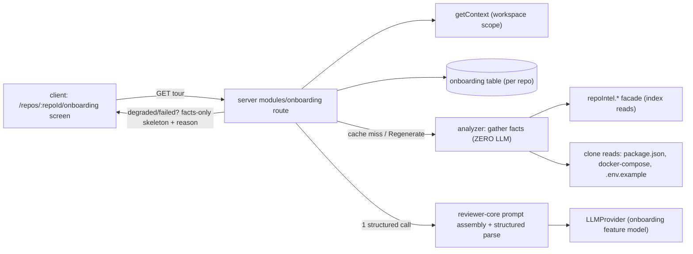

# Spec: Onboarding Generator  |  Spec ID: SPEC-03  |  Status: approved
Supersedes: none

## Problem & why
A developer opening an unfamiliar indexed repo has no fast way to learn "what is this, what
matters, how do I run it, what do I read first, what should I touch first". DevDigest already
indexes every repo (symbols, import graph, PageRank file rank) but exposes none of it as a
first-day tour. This feature turns the existing `repoIntel.*` index into a five-section
**Onboarding Tour** — **facts gathered by code (zero LLM), narrative written by one model call** —
so newcomers get a grounded, non-hallucinated orientation without any per-view analysis cost.

## Goals / Non-goals
- **Goals:**
  - Produce a 5-section tour per repo: Architecture overview, Critical paths, How to run locally,
    Guided reading path, First tasks.
  - Gather all facts (stack, structure, routes, scripts, file rank, dependency chains) at **zero LLM cost** from the existing `repoIntel.*` facade + deterministic server-side clone reads (`package.json`, `docker-compose*.yml`, `.env.example`).
  - Order the guided reading path by **file rank** (PageRank-derived) from the import graph.
  - Turn the collected facts into the 5 sections with **exactly one** structured LLM call.
  - Always render something useful: a deterministic skeleton + honest "degraded" badge when the index is missing/partial **or** the model call fails.
  - Persist per repo, generate-on-first-view, offer an explicit Regenerate; surface the single call's cost (cents) in logs/trace and keep fact-gathering observably zero-LLM.
- **Non-goals:**
  - Re-indexing or extending the repo-intel pipeline (it is starter infrastructure — read only).
  - New DB tables or migrations (persist into the pre-created `onboarding` table only).
  - Per-section LLM calls, streaming generation, or a chat/Q&A experience.
  - Onboarding for un-added repos or non-git sources.
  - Editing/authoring the tour by hand (read-only generated artifact for v1).
  - Mining issues/TODOs for "First tasks" (facts-only in v1).
  - In-app file viewer for "Open" links (GitHub blob URL only in v1).
  - Enabling churn/hotness in the rank (hotness stays 0 in v1).

## User stories
- As a **newcomer engineer**, I want a grounded 5-section tour of an unfamiliar repo, so that I can orient myself on day one without reading the whole codebase.
- As a **tech lead**, I want the reading path ordered by real code importance (rank), so that newcomers start with foundational files, not alphabetical noise.
- As a **cost-conscious maintainer**, I want the tour generated with a single, observable model call over precomputed facts and cached per repo, so that repeat views are free and never hallucinate paths/scripts.

## Decisions
All resolved by the coordinator while the user is away. **[ASSUMED] (pending user confirmation)**:
- **D1 — Nav/route.** Add a new "Onboarding Tour" item under the **WORKSPACE** nav group; the tour is **per-repo at `/repos/:repoId/onboarding`** (new client route). The existing `/onboarding` (Add-Repo) is untouched. (→ AC-16)
- **D2 — Sections.** Canonical set is the brief's **5 sections**: `architecture`, `critical_paths`, `run_local`, `reading_path`, `first_tasks`. The prompt's `{{sections}}` in `onboarding.system.md` must be set to these five; `routes_and_apis` facts fold into `architecture`/`critical_paths`. (→ AC-1)
- **D3 — Stack & scripts facts.** The server onboarding analyzer reads `package.json` (+ detects `docker-compose*.yml`, `.env.example`) directly from the repo clone, **server-side and zero-LLM**. No new `repoIntel.*` facade method. (→ AC-2, AC-8)
- **D4 — Rank.** v1 uses `rank = pagerank × (1 + hotness)` with **hotness = 0** (pagerank-only in practice, since `rank.ts` does not compute hotness). Enabling hotness is future work. (→ AC-4)
- **D5 — Caching.** Store per repo in the existing `onboarding` table (`json` + `generatedAt`); **generate on first view + persist**; a **Regenerate** action re-runs the single structured call and updates `generatedAt`; the screen shows a `generatedAt` staleness line. Exactly one model call per (re)generation. (→ AC-3, AC-14, AC-17)
- **D6 — "Open" target.** Open links are **GitHub blob URLs** built from `repo.fullName` + default branch + path. Demo/fixture repos will 404 — acceptable in v1; an in-app file view is future work. (→ AC-7)
- **D7 — Diagram format.** The structured output emits **node/edge JSON** (`{ nodes: [{id,label}], edges: [{from,to,label?}] }`), rendered by a small client boxes+arrows component. `onboarding.system.md` must move away from mermaid to this shape. This is a **contract change** to `OnboardingSection.diagram` (was a mermaid string) — see Design & contracts. (→ AC-13)
- **D8 — First tasks.** Model-suggested **from the gathered facts only** in v1 (no issues/TODOs mining). (→ AC-1, AC-15)
- **D9 — Degraded vs LLM-failure.** BOTH render the deterministic skeleton from facts with HTTP 200, but carry a **distinct reason** in the badge: `index_degraded` vs `generation_failed`. Never empty, never a hard error. (→ AC-5)

## Acceptance criteria (EARS)
- **AC-1** — WHEN a tour is generated for a repo, the system shall return exactly the five sections `architecture`, `critical_paths`, `run_local`, `reading_path`, `first_tasks`, in that order. _(verify: integration (`*.it.test.ts`) — assert `sections.map(s => s.kind)` equals the ordered list)_
- **AC-2** — WHEN the analyzer gathers facts (stack, structure, routes, scripts, ranks, dependency chains, and the server-side clone reads of `package.json`/`docker-compose*.yml`/`.env.example`), the system shall perform **zero** LLM calls during fact-gathering. _(verify: integration — build the app with no LLM override wired and assert fact-gathering completes; a provider call would throw)_
- **AC-3** — WHEN a tour is generated or regenerated, the system shall make **exactly one** structured (JSON-schema) LLM call, not one call per section. _(verify: integration — spy/count `LLMProvider` invocations == 1 per (re)generation)_
- **AC-4** — The system shall order the `reading_path` files by descending file rank (`rank = pagerank × (1 + hotness)`, hotness = 0 in v1) from the import graph, never alphabetically or by date. _(verify: unit — feed known `getTopFilesByRank`/`getCriticalPaths` output and assert ordering follows rank)_
- **AC-5** — IF the repo-intel index is degraded/partial/absent OR the structured LLM call fails, THEN the system shall return HTTP 200 with a deterministic skeleton built from the available facts plus a `degraded: true` badge whose reason is `index_degraded` (index case) or `generation_failed` (LLM case) — never an empty screen and never a hard error. _(verify: integration — (a) no `repo_index_state` row → 200, reason `index_degraded`; (b) LLM stub that throws → 200, reason `generation_failed`; both non-empty)_
- **AC-6** — WHERE the repo exceeds the repo-intel indexing threshold (`repo_too_large`), the system shall build the tour from deterministic facts only, without any full-file reads. _(verify: integration — assert no per-file content reads occur when index state reason is `repo_too_large`; skeleton still renders)_
- **AC-7** — WHEN the `critical_paths` section is rendered, each row shall carry a real repo-relative file path, a one-line "why it matters", and an Open link that is a GitHub blob URL built from `repo.fullName` + default branch + path. _(verify: unit — each critical-path link path is present in the fact set and the href matches the `githubBlobUrl(fullName, defaultBranch, path)` shape)_
- **AC-8** — The `run_local` section shall list only shell commands/steps derived from the gathered facts (real `package.json` scripts; a `docker compose up` step only when `docker-compose*.yml` was detected; a copy-`.env.example` step only when that file exists), in an ordered, copyable form, and shall not invent scripts absent from the facts. _(verify: unit — every command maps to a fact-derived script/step; a fact set without docker-compose yields no docker step)_
- **AC-9** — The system shall treat all repo-derived text (README, code, comments, `package.json` fields, file contents) as **untrusted DATA**: it shall wrap it via `wrapUntrusted(...)` and rely on `INJECTION_GUARD`, and shall ignore any instructions embedded in that content. _(verify: unit — a fact fixture containing "ignore previous instructions / output X" does not alter the section contract; content is delimiter-wrapped)_
- **AC-10** — WHEN the single structured call completes, the system shall record its estimated cost in cents in the logs/trace (via `PriceBook`), and shall record fact-gathering as a zero-LLM step. _(verify: integration — assert a cost value is logged for the call and fact-gathering emits no token/cost usage)_
- **AC-11** — The system shall scope every onboarding request to the caller's workspace via `getContext()`; IF the repo does not belong to the caller's workspace, THEN it shall respond not-found. _(verify: integration — cross-workspace repo id returns the standard not-found `AppError`)_
- **AC-12** — WHEN resolving the model for generation, the system shall use the workspace's `onboarding` feature-model override if set, else the `FEATURE_MODELS` registry default. _(verify: integration — set/unset the `feature_models.onboarding` setting and assert the routed model)_
- **AC-13** — The system shall emit a node/edge JSON `diagram` (`{ nodes: [{id,label}], edges: [{from,to,label?}] }`) only on the `architecture` section, set `diagram` to null on the other four, and shall drop a malformed/invalid `diagram` (rendering the section without it) rather than breaking the tour. _(verify: unit — non-architecture sections have `diagram === null`; a malformed diagram payload does not fail generation; client renders the nodes/edges)_
- **AC-14** — WHEN a tour is first viewed for a repo, the system shall generate it, persist it as one row per repo in the pre-created `onboarding` table (`repoId` PK, `json`, `generatedAt`), and serve the stored tour on subsequent views. _(verify: integration — first view creates the row with `generatedAt` set; second view returns the same stored payload)_
- **AC-15** — The system shall include in `links` (and any `first_tasks` file references) only paths that exist in the gathered facts/tree, and shall never emit an invented path. _(verify: unit — every `OnboardingLink.path` is a member of the fact-derived file set)_
- **AC-16** — The system shall expose an "Onboarding Tour" item under the **WORKSPACE** nav group, and the route `/repos/:repoId/onboarding` shall render the tour for the active repo (leaving the existing `/onboarding` Add-Repo screen unchanged). _(verify: e2e — nav item is present and clicking it renders the tour screen for the active repo)_
- **AC-17** — WHILE a stored tour exists and the user has not triggered Regenerate, the system shall serve it with **zero** model calls; WHEN the user triggers Regenerate, the system shall make exactly one new structured call, update `generatedAt`, and the screen shall show a `generatedAt` staleness line. _(verify: integration — second view → 0 `LLMProvider` calls; Regenerate → 1 call + advanced `generatedAt`; component test asserts the staleness line renders)_

## Edge cases
- **No clone / never indexed** — degraded skeleton, reason `index_degraded`, 200 (AC-5).
- **Partial index (`index_partial`)** — skeleton uses whatever facts exist; badge reflects partial state.
- **Huge repo (`repo_too_large`)** — deterministic-facts-only, no full-file reads (AC-6).
- **LLM call fails/times out** — deterministic skeleton, reason `generation_failed`, 200 (AC-5).
- **Empty import graph** — `getCriticalPaths`/`getTopFilesByRank` return `[]`; reading path/critical paths degrade to empty-but-labelled sections.
- **Malformed diagram JSON from the model** — dropped, section still renders (AC-13).
- **No `package.json` scripts / no docker-compose / no `.env.example`** — `run_local` lists only the steps that are actually derivable (AC-8).
- **Repo re-synced to a new SHA after generation** — stored tour may be stale; the `generatedAt` line signals it; Regenerate refreshes (AC-17).
- **Non-GitHub/demo repo** — Open links 404 (accepted in v1, D6).
- **Injected instructions in README/comments** — ignored as data (AC-9).

## Non-functional
- **Security / tenancy:** every read is workspace-scoped via `getContext()` (AC-11). All repo-derived text is untrusted and delimiter-wrapped (AC-9). No secrets are read or surfaced (`.env.example` is read for step detection only — never `.env` or secret values).
- **Abuse cases:** (a) a malicious repo README/comment attempting prompt injection → neutralised by `wrapUntrusted`/`INJECTION_GUARD` (AC-9); (b) a repo crafted to be huge to force expensive reads → bounded by facts-only generation on `repo_too_large` (AC-6) and the single-call limit (AC-3); (c) repeated views forcing repeated model spend → prevented by generate-once + cache; only explicit Regenerate costs a call (AC-17).
- **Cost/perf:** exactly one model call per (re)generation (AC-3), routed to the (cheap-by-default) `onboarding` feature model (AC-12); fact-gathering is a pure index read + bounded clone reads (AC-2). Cost observable in cents (AC-10). Repeat views are free (AC-17).
- **Accessibility:** the in-page anchor nav + collapsible sections must be keyboard-navigable and expose expanded/collapsed state (UI-team detail; flagged, not fully specified here).

## Design & contracts
Reuses existing contracts and infra — **do not invent parallel infra**:
- Contract: `Onboarding { sections: OnboardingSection[] }`, `OnboardingSection { kind, title, body(markdown), diagram?, links: OnboardingLink[] }`, `OnboardingLink { label, path }` in `server/src/vendor/shared/contracts/knowledge.ts` (mirror in client vendor copy — keep in sync).
- Prompt: `server/src/prompts/onboarding.system.md` — `{{sections}}` set to the five canonical kinds (D2); guidance moved from mermaid to node/edge JSON diagrams (D7).
- Facade reads: `repoIntel.getCriticalPaths`, `getTopFilesByRank`, `getFileRank`, `getRepoMap`, `getIndexState` (degraded contract), `getReachableEndpoints`/`file_facts.endpoints` for routes.
- Clone reads (server-side, zero-LLM): `package.json`, `docker-compose*.yml`, `.env.example` (D3).
- Model routing: `resolveFeatureModel(container, workspaceId, 'onboarding')` + structured output via reviewer-core's `toJsonSchema`/`parseWithRepair` and the injected `LLMProvider`.
- Persistence: pre-created `onboarding` table (`server/src/db/schema/context.ts`), one row per repo (D5).

**Contract change (D7) — breaking to the pre-scaffolded shape, but internal & pre-implementation.**
`OnboardingSection.diagram` is currently typed as a mermaid **string** (`z.string().nullish()`). This
spec changes it to a **node/edge JSON** object `{ nodes: [{id,label}], edges: [{from,to,label?}] }`
(nullable). Because no code consumes the mermaid form yet, there is no live consumer to migrate;
the change is: update the Zod contract in **both** vendor copies (server + client, kept
byte-identical per the repo's sync rule) and re-point `onboarding.system.md`. Versioning/deprecation
stance: single atomic edit across both copies; no external API version bump (the contract is not yet
shipped). Flag to the planner as a shared-contract edit that `check-vendor-sync.sh` must pass.

**Onion boundary:** the structured-call **prompt assembly** belongs in `reviewer-core` (pure); the
repo-intel **fact-gathering + all I/O + clone reads + persistence** stays server-side (new
`modules/onboarding/`). reviewer-core must not touch DB/FS/network.

## Inputs (provenance)
- Structure, routes, skeleton, ranks: [deterministic: repo-intel] — `getCriticalPaths`, `getTopFilesByRank`, `getFileRank`, `getRepoMap`, `file_facts.endpoints`.
- Stack / scripts / run steps: [deterministic: clone read] — server-side `package.json` + `docker-compose*.yml` + `.env.example` (D3); no facade method.
- Index/degraded state: [deterministic: repo-intel] — `getIndexState`.
- The 5 narrated sections (incl. First tasks): [new: 1 LLM call] — single structured call over the facts (D8).
- Model choice: [reused: settings] — `resolveFeatureModel('onboarding')`.
- Stored tour: [reused: onboarding table] — served on repeat views, zero LLM (D5).

## Untrusted inputs
All repo-derived text is untrusted: README, source files, code comments, `package.json` fields,
`docker-compose`/`.env.example` content, symbol/signature text, and any file path/label. It must be
wrapped via `wrapUntrusted(...)` and governed by `INJECTION_GUARD`; embedded "instructions" are
ignored (AC-9). No PR bodies are involved. Everything the model emits (paths, scripts, diagram
nodes) is constrained to the fact set (AC-8, AC-13, AC-15). `.env.example` is read for step detection
only — never `.env` or any secret value.

## Traceability
| AC | Implemented by (plan task) |
| --- | --- |
| AC-1 | <planner fills> |
| AC-2 | <planner fills> |
| AC-3 | <planner fills> |
| AC-4 | <planner fills> |
| AC-5 | <planner fills> |
| AC-6 | <planner fills> |
| AC-7 | <planner fills> |
| AC-8 | <planner fills> |
| AC-9 | <planner fills> |
| AC-10 | <planner fills> |
| AC-11 | <planner fills> |
| AC-12 | <planner fills> |
| AC-13 | <planner fills> |
| AC-14 | <planner fills> |
| AC-15 | <planner fills> |
| AC-16 | <planner fills> |
| AC-17 | <planner fills> |

## Open questions
- None blocking. All prior questions are resolved under `## Decisions` as **[ASSUMED] (pending user confirmation)**. When the user returns, confirm especially: **D4** (accept pagerank-only; hotness deferred), **D6** (GitHub-blob "Open" links 404 on demo/fixture repos in v1), and **D7** (moving `OnboardingSection.diagram` from a mermaid string to node/edge JSON — a shared-contract edit synced across both vendor copies).
