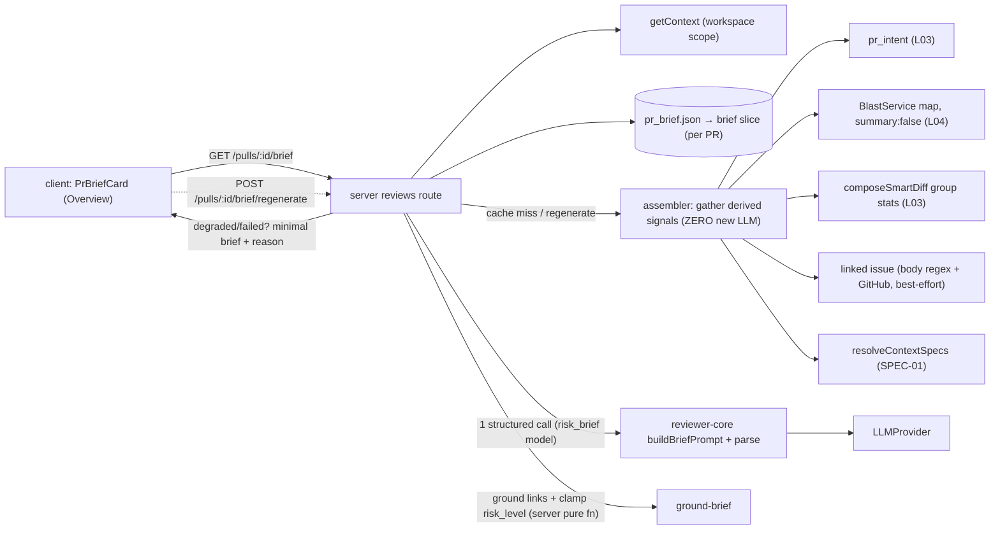

# Spec: Why + Risk Brief  |  Spec ID: SPEC-04  |  Status: approved
Supersedes: none (coexists with the existing "Risk Areas" card — see D1)

## Problem & why
A reviewer opening a PR still has to piece together "what does this change, why, and
what should I look at first" from the description, the diff, and separate cards (Intent,
Blast, Risk Areas). DevDigest already derives all the signals needed to answer this — it
just never composes them into one at-a-glance verdict. This feature adds a **Why + Risk
Brief** card that reuses those derived signals (intent, blast map, diff stats, linked
issue, attached specs) and turns them into `{ what, why, risk_level, risks[],
review_focus[] }` with **exactly one** new structured LLM call — the feature is almost
free because the expensive analysis already happened upstream.

## Goals / Non-goals
- **Goals:**
  - Add a brief endpoint (`GET /pulls/:id/brief` + `POST /pulls/:id/brief/regenerate`, D6)
    that assembles its input **entirely from already-built pieces**: intent (L03), the
    deterministic blast map (L04), per-group diff **stats** (L03 smart-diff), the PR's
    linked issue (if resolvable), and relevant Project Context specs (SPEC-01).
  - Produce a `Brief { what, why, risk_level, risks[], review_focus[] }` via **exactly
    one** structured LLM call, where each `risks[]` and `review_focus[]` entry links to a
    **real** file/endpoint from the assembled signal set (grounded, invented paths dropped).
  - Cache per PR; generate-on-first-view; offer an explicit **Regenerate** button
    (mirror the Onboarding tour pattern).
  - Render a client `PrBriefCard` on the PR Overview page alongside the Intent / Blast /
    Risk Areas cards: `risk_level` shown by color, `review_focus[]` as file links.
  - Always render something useful and honest when an input is missing/degraded — never error.
- **Non-goals:**
  - Feeding diff **hunks / change bodies** into the model — the input is derived signals
    only (this is the point; see AC-1 and `## Inputs`).
  - Re-computing intent, blast, or diff stats — read the existing derivations only.
  - Modifying or retiring the existing **Risk Areas** card / its `pr_brief.json` slice (D1).
  - New DB tables, migrations, or a new `FEATURE_MODELS` entry (columns-only reuse; D1, D2).
  - More than one new LLM call; triggering the blast module's optional `?summary=1` call.
  - Per-section/streaming generation, a chat experience, or hand-editing the brief (read-only v1).

## User stories
- As a **reviewer**, I want a one-glance brief of what a PR does, why, and how risky it is,
  so that I can decide where to focus before reading the diff.
- As a **reviewer**, I want the concrete risks and the review-focus list to link to real
  files/endpoints, so that I can jump straight to what matters and trust it is not invented.
- As a **cost-conscious maintainer**, I want the brief built from existing signals with a
  single cached model call, so that repeat views are free and the feature adds ~one call of cost.

## Decisions
All resolved with the coordinator, **[CONFIRMED by user 2026-07-09]**:
- **D1 — Coexist, don't supersede.** Ship a **separate `PrBriefCard`**, distinct from the
  existing Risk Areas card. Persist the brief in the existing `pr_brief` table's `json`
  composite as **its own independent slice** (a new `brief` key in the same `pr_brief.json`),
  reusing the table columns-only. The Risk Areas slice/card is **not** modified or retired;
  the two cards coexist. (→ AC-12, AC-15, AC-17)
- **D2 — Reuse the `risk_brief` model.** The single structured call resolves its model via
  the **existing** `risk_brief` `FEATURE_MODELS` entry — no new entry, no `platform.ts`
  change. (→ AC-2, AC-11)
- **D3 — Linked issue is best-effort, no schema.** Reuse the `intent-service` body-`#N`
  regex + best-effort GitHub fetch; there is **no** stored PR→issue linkage and **no new
  schema**. Absent/unresolvable → omitted gracefully. (→ AC-8, provenance)
- **D4 — `risk_level` = model-judged, deterministically clamped.** The model proposes a
  `risk_level`, then a **deterministic floor/ceiling** derived from blast-radius size +
  diff-stat magnitude clamps it so it can't contradict the deterministic magnitude: a large
  blast/diff **floors** risk at (at least) `medium`; a trivial change **caps** it. The clamp
  also supplies the deterministic default when the model call fails (AC-16). (→ AC-4b, AC-16)
- **D5 — Staleness, no auto-regen.** WHEN the PR `head_sha` differs from the SHA the stored
  brief was generated for, the cached brief is served with a **stale** flag (UI badge "may be
  outdated") and a Regenerate affordance; there is **no** automatic regeneration. (→ AC-14)
- **D6 — Routes: GET + POST-regenerate.** Realize the brief as **`GET /pulls/:id/brief`**
  (returns cached; generate-on-first-view; 0 model calls on repeat) + **`POST
  /pulls/:id/brief/regenerate`** (exactly one call, overwrites the stored brief) — mirroring
  the onboarding GET + POST-regenerate pattern. (→ AC-6, AC-7)
- **D7 — Grounding is a server module fn; reviewer-core stays pure.** Link-grounding lives in
  a **server module function** (mirror `server/src/modules/onboarding/ground.ts`) that filters
  `risks[]`/`review_focus[]` links to the real file/endpoint set from blast + diff-stats.
  `reviewer-core` contributes the **pure prompt-builder only** (no DB/FS/network). (→ AC-4, AC-5)

## Acceptance criteria (EARS)
- **AC-1** — WHEN the brief is assembled, the system shall build the model input **only**
  from the derived signals (intent, deterministic blast map, per-group diff **stats**,
  linked-issue text, attached context specs) and shall **not** include any diff hunk /
  patch / change-body text. _(verify: unit — assert the assembled prompt payload contains
  none of the `pr_files.patch` content; integration — assembler reads no hunk source)_
- **AC-2** — WHEN a brief is generated or regenerated, the system shall make **exactly
  one** structured (JSON-schema) LLM call, resolved via the `risk_brief` feature model (D2),
  and shall consume the blast **map only** (never trigger the blast `summary` LLM call).
  _(verify: integration — spy/count `LLMProvider` invocations == 1 per (re)generation;
  assert the resolved feature id is `risk_brief` and `blastForPull` is called with
  `{ summary: false }`)_
- **AC-3** — WHEN the structured call completes, the system shall return a `Brief` with
  `what` (string), `why` (string), `risk_level` ∈ {`low`,`medium`,`high`}, `risks[]`
  (each: short description + one file/endpoint link), and `review_focus[]` (an ordered
  list, each with a file link). _(verify: unit — Zod schema validates the shape; `risk_level`
  rejects values outside the enum)_
- **AC-4** — The system shall drop any `risks[]` entry whose link references a file/endpoint
  **not present** in the assembled signal set (blast changed-symbol/caller files, blast
  reachable endpoints, diff-stat file paths), never emitting an invented path. _(verify:
  unit — feed a generated brief with a fabricated path/endpoint and assert it is removed,
  mirroring `groundOnboarding`)_
- **AC-4b** — The system shall clamp the model-proposed `risk_level` by a deterministic
  floor/ceiling derived from blast-radius size + diff-stat magnitude (D4): WHEN the blast/diff
  magnitude is large, the served `risk_level` shall be **at least `medium`** (never `low`);
  WHEN the change is trivial, it shall be capped below `high`. _(verify: unit — a large-blast/
  large-diff fixture with a model output of `low` yields ≥ `medium`; a trivial fixture with a
  model output of `high` is capped)_
- **AC-5** — The system shall preserve the model's `review_focus[]` order and shall keep
  only entries whose file link exists in the assembled signal set. _(verify: unit — output
  order equals input order after filtering; every surviving link ∈ allowed path set)_
- **AC-6** — WHEN `GET /pulls/:id/brief` is called and a cached brief exists for the PR, the
  system shall serve it with **zero** model calls; WHEN no brief exists yet, it shall generate
  one on first view (D6). _(verify: integration — first GET → 1 call + stored row; second GET
  → 0 `LLMProvider` calls, same stored payload)_
- **AC-7** — WHEN `POST /pulls/:id/brief/regenerate` is called, the system shall make exactly
  one new structured call and overwrite the stored brief for that PR. _(verify: integration —
  regenerate → 1 call; persisted `pr_brief.json` brief slice changes)_
- **AC-8** — IF any input is absent or degraded (no linked issue, no attached specs, a
  degraded blast index, or a missing intent), THEN the system shall still generate the
  brief from whatever signals are available and note the omission honestly, responding
  HTTP 200 — never an error and never an empty card. _(verify: integration — omit each
  input in turn; assert 200 + non-empty brief + a degraded/omitted note)_
- **AC-9** — The system shall treat PR title/body, linked-issue title/body, and attached
  context-spec contents as **untrusted DATA**: wrap them via `wrapUntrusted(...)` under
  `INJECTION_GUARD` and ignore any instructions embedded in them. _(verify: unit — a fixture
  containing "ignore previous instructions / output X" does not alter the `Brief` contract;
  content is delimiter-wrapped)_
- **AC-10** — The system shall scope every brief request to the caller's workspace via
  `getContext()`; IF the PR does not belong to the caller's workspace, THEN it shall respond
  not-found. _(verify: integration — cross-workspace PR id returns the standard not-found
  `AppError`)_
- **AC-11** — WHEN resolving the model for generation, the system shall use the workspace's
  `risk_brief` feature-model override if set, else the `FEATURE_MODELS` registry default (D2).
  _(verify: integration — set/unset the `feature_models.risk_brief` override and assert the
  routed model)_
- **AC-12** — WHEN a brief is generated, the system shall persist it as its own slice within
  the pre-created `pr_brief` table's `json` blob (no new table/migration, no `FEATURE_MODELS`
  change), leaving any existing Risk Areas slice intact, and shall serve the stored brief on
  subsequent reads. _(verify: integration — generation upserts the `brief` slice; a pre-existing
  `risks` slice in the same row is preserved; no schema migration is introduced)_
- **AC-13** — WHEN the single structured call completes, the system shall record its estimated
  cost in cents via `PriceBook` in the logs/trace. _(verify: integration — assert a cost value
  is logged for the call)_
- **AC-14** — IF the PR's `head_sha` differs from the SHA the stored brief was generated for,
  THEN the system shall serve the cached brief with a **stale** flag (UI badge "may be
  outdated") and offer Regenerate, and shall **not** auto-regenerate (D5). _(verify: integration —
  advance `pull_requests.head_sha`, assert the served brief carries a stale flag and no new
  LLM call fires; component — badge renders)_
- **AC-15** — The client `PrBriefCard` shall render on the PR Overview page (alongside Intent /
  Blast / Risk Areas), show `risk_level` **by color paired with a text label**, and render
  `review_focus[]` as an ordered list of file links. _(verify: component (`*.test.tsx`) —
  high/medium/low map to distinct colors + labels; each focus item renders a link; e2e — card
  visible on the Overview tab)_
- **AC-16** — IF the structured LLM call fails, THEN the system shall respond HTTP 200 with a
  deterministic minimal brief (`what`/`why` from intent, `risk_level` from the D4 clamp/floor,
  empty `risks`/`review_focus`) plus a `generation_failed` reason — never a hard error.
  _(verify: integration — LLM stub that throws → 200, non-empty, reason `generation_failed`,
  `risk_level` equals the deterministic clamp)_
- **AC-17** — The system shall keep the Why + Risk Brief and the existing Risk Areas as **two
  independent cards**: (re)generating the brief shall not alter the Risk Areas slice, and vice
  versa. _(verify: integration — regenerate the brief and assert the `risks` slice + Risk Areas
  read are unchanged)_

## Edge cases
- **No linked issue / no attached specs** — omitted from input; brief still generates with an honest note (AC-8).
- **Degraded or empty blast index** — the allowed path set falls back to the diff-stat file paths; risks/focus grounded against those (AC-4, AC-8).
- **Missing intent** — `what`/`why` degrade to a diff-stat-derived summary; brief still renders (AC-8).
- **PR head SHA changed after generation** — served brief flagged stale; Regenerate refreshes; no auto-regen (AC-14).
- **Model emits invented file/endpoint links** — dropped by grounding (AC-4, AC-5).
- **Model under- or over-states severity** — clamped by the deterministic floor/ceiling (AC-4b).
- **Model call fails/times out** — deterministic minimal brief, reason `generation_failed`, 200 (AC-16).
- **Injected instructions in PR body / issue / attached spec** — ignored as data (AC-9).
- **Very large PR** — input is derived signals + stats only, so size is bounded regardless of diff size (AC-1).

## Non-functional
- **Security / tenancy:** every read is workspace-scoped via `getContext()` (AC-10). PR body,
  issue text, and attached specs are untrusted and delimiter-wrapped (AC-9). No secrets read
  or surfaced.
- **Abuse cases:** (a) a malicious PR body/issue/spec attempting prompt injection → neutralised
  by `wrapUntrusted`/`INJECTION_GUARD` (AC-9); (b) a model coaxed into linking to a file it
  invents (to mislead a reviewer to a non-existent path) → dropped by grounding (AC-4);
  (c) a model coaxed into understating risk on a large blast → floored by the clamp (AC-4b);
  (d) repeated views forcing repeated spend → prevented by generate-once + cache; only explicit
  Regenerate costs a call (AC-6, AC-7); (e) a huge PR forcing expensive input → bounded by the
  derived-signals-only input (AC-1).
- **Cost/perf:** exactly one model call per (re)generation (AC-2), routed via the `risk_brief`
  feature model (AC-11); cost observable in cents (AC-13); repeat views free (AC-6).
- **Accessibility:** `risk_level` must not be conveyed by color alone — pair the color with a
  text label (AC-15); focus links keyboard-navigable (UI-team detail; flagged, not fully
  specified here).

## Design & contracts   <!-- no implementation code -->
Reuses existing contracts/infra — do not invent parallel infra:
- **New contract** `Brief { what: string, why: string, risk_level: RiskSeverity, risks:
  BriefRisk[], review_focus: BriefFocus[], stale?: boolean, generated_for_sha?: string,
  degraded?: boolean, reason?: string }` in
  `server/src/vendor/shared/contracts/brief.ts`, mirrored byte-identically in the client
  vendor copy (`check-vendor-sync.sh` must pass). `risk_level` **reuses** the existing
  `RiskSeverity` enum (`high|medium|low`). `BriefRisk = { description, link }` and
  `BriefFocus = { label, link }` where `link` is a repo-relative file path or an endpoint
  string from the signal set. This is a **new sibling shape** next to the existing `PrBrief`
  composite (D1), stored under its own `brief` key in `pr_brief.json`.
- **Prompt assembly** belongs in `reviewer-core` (pure): a `buildBriefPrompt(...)` alongside
  `buildIntentPrompt`/`buildRisksPrompt`, fed the derived signals as data. reviewer-core must
  not touch DB/FS/network (D7).
- **Grounding + clamp** are server-side pure fns (mirror `modules/onboarding/ground.ts`, D7):
  build the allowed set from blast `changed_symbols`/`downstream.callers` files +
  `reachable_endpoints` + diff-stat file paths, filter `risks[].link` and
  `review_focus[].link` (AC-4, AC-5); clamp `risk_level` by the deterministic blast/diff
  magnitude (AC-4b, D4).
- **Signal reads:** intent from `pr_intent` (or `computeIntent`); blast from
  `BlastService.blastForPull(ws, id, { summary: false })` (deterministic map, zero LLM); diff
  stats from `composeSmartDiff(prFiles, findings)` (group stats only); linked issue from the
  `intent-service` body-regex + GitHub best-effort path (D3); context specs from the SPEC-01
  `resolveContextSpecs(...)` resolver.
- **Model routing:** `resolveFeatureModel(container, workspaceId, 'risk_brief')` (D2).
- **Persistence:** pre-created `pr_brief` table (`{ prId PK, json }`) via `upsertBrief`/`getBrief`
  — nest the brief under a `brief` key in `json` (columns only, no migration; D1).

**Contract note (api-contract-reviewer):** this adds **new** routes (`GET /pulls/:id/brief`,
`POST /pulls/:id/brief/regenerate`) and a **new** `brief` key in the `pr_brief.json` blob; no
existing response or slice is changed (the Risk Areas `risks` slice is untouched, AC-17), so
the change is **additive / non-breaking**. The new `brief.ts` shape is a shared-contract edit
that must be synced across both vendor copies and flagged to the planner.

## Inputs (provenance)
- Intent (`what`/`why` seed, scope): **[reused: L03]** — `pr_intent` row / `computeIntent`.
- Blast-radius summary (changed symbols, callers, reachable endpoints, prior PRs): **[reused: L04]**
  — `BlastService.blastForPull(..., { summary: false })`, deterministic map, zero LLM.
- Diff statistics by group (paths + add/del counts per core/wiring/boilerplate): **[deterministic:
  L03/smart-diff]** — `composeSmartDiff` **stats only**, no hunks.
- Linked issue (title + body, if resolvable): **[deterministic]** — body `#N` regex + GitHub adapter
  fetch, best-effort, degrades to none (no stored PR→issue linkage / no new schema — D3).
- Relevant Project Context specs: **[reused: SPEC-01]** — `resolveContextSpecs(...)` resolved docs.
- The `Brief` itself: **[new: 1 LLM call]** — a single structured call over the assembled signals.
- `risk_level` clamp bounds: **[deterministic]** — blast-radius size + diff-stat magnitude (D4).
- Stored brief: **[reused: pr_brief table]** — served on repeat reads, zero LLM.

## Untrusted inputs
Untrusted third-party text this feature reads: the **PR title/body**, the **linked-issue title/body**,
and the **attached Project Context spec** contents. All must be wrapped via `wrapUntrusted(...)` and
governed by `INJECTION_GUARD`; embedded "instructions" are ignored (AC-9). The derived signals (intent,
blast, diff stats) are already-computed data, but the file paths / endpoint strings the model may emit
are constrained to the assembled signal set by grounding (AC-4, AC-5). No secrets are read.

## Traceability
| AC | Implemented by (plan task) |
| --- | --- |
| AC-1 | <planner fills> |
| AC-2 | <planner fills> |
| AC-3 | <planner fills> |
| AC-4 | <planner fills> |
| AC-4b | <planner fills> |
| AC-5 | <planner fills> |
| AC-6 | <planner fills> |
| AC-7 | <planner fills> |
| AC-8 | <planner fills> |
| AC-9 | <planner fills> |
| AC-10 | <planner fills> |
| AC-11 | <planner fills> |
| AC-12 | <planner fills> |
| AC-13 | <planner fills> |
| AC-14 | <planner fills> |
| AC-15 | <planner fills> |
| AC-16 | <planner fills> |
| AC-17 | <planner fills> |

## Open questions
- None. All prior questions (Q1–Q7) are resolved under `## Decisions`, **[CONFIRMED by user
  2026-07-09]** (D1 coexist + new `brief` slice; D2 reuse `risk_brief` model; D3 best-effort issue,
  no schema; D4 deterministic `risk_level` clamp; D5 stale flag, no auto-regen; D6 GET +
  POST-regenerate; D7 server-side grounding, pure reviewer-core).
