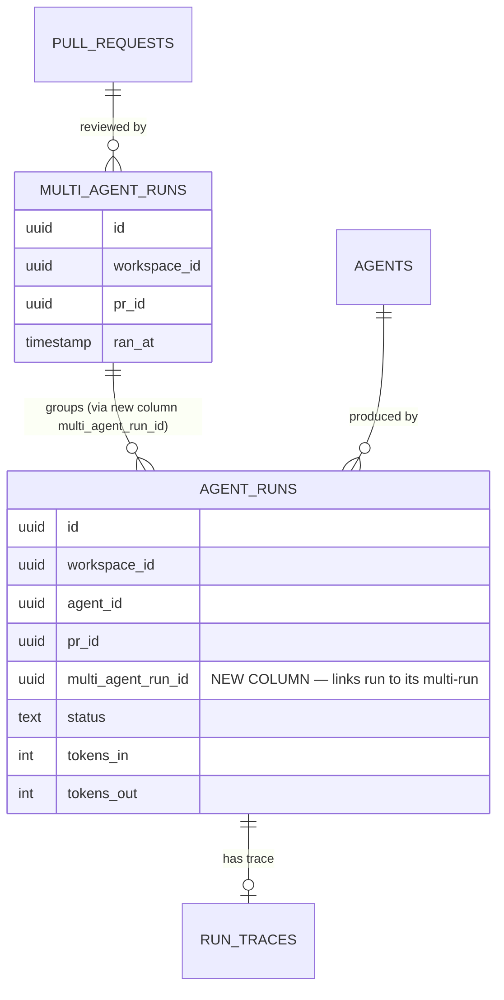
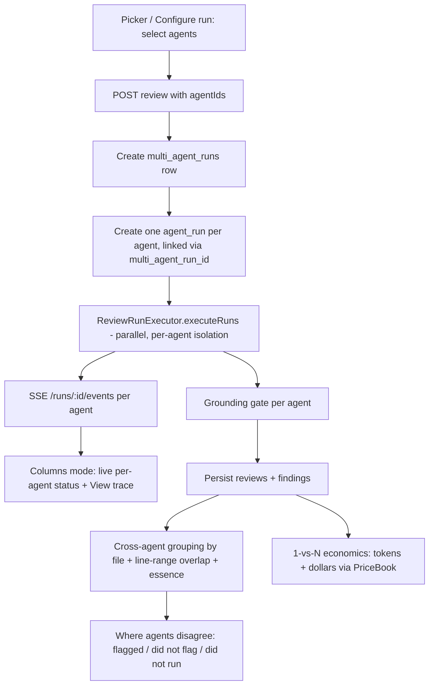
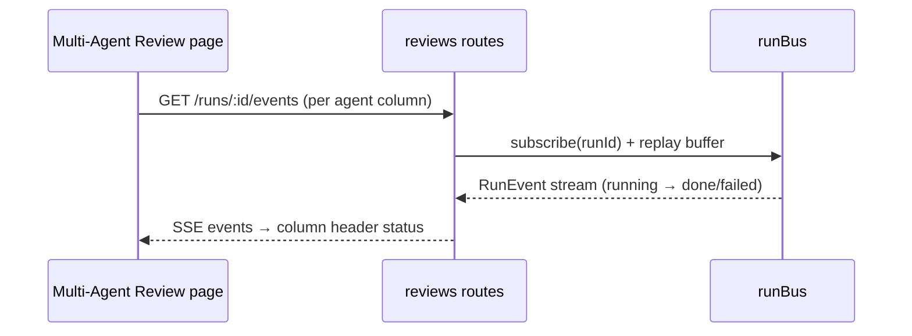

# Spec: Multi-Agent Review — live PR review by many agents  |  Spec ID: SPEC-06  |  Status: implemented
Supersedes: none

## Problem & why
A real PR is heterogeneous — security, performance, and domain-logic issues arrive
together, but one agent has one focus, so a single pass under-covers the PR. Running
several specialized agents in **parallel** covers all angles in one pass, but two new
pains appear: (1) three agents independently report the same obvious bug, so the user
reads three identical findings and stops trusting the tool; and (2) running many agents
with no live window is minutes of staring at a spinner. This feature adds an agent
picker + a Multi-Agent Review page that fans out the existing parallel executor, groups
duplicate/conflicting findings by code location, and surfaces per-agent live status.

## Goals / Non-goals
- **Goals:**
  - Replace the PR-page `RunReviewDropdown` with a "Pick agents to run" checkbox picker that runs a **selected set** of agents.
  - A **Multi-Agent Review → Configure run** page: pick a PR, checkbox agents (each row shows a time & cost estimate from past runs), a "Run multi-agent review (N)" button, and a **summary pre-run estimate** before launch.
  - Persist a **multi-agent run** that links the separate `agent_runs` produced by one launch (build out the `multi_agent_runs` stub via a link column).
  - A **Multi-Agent Review results page** with two toggleable modes — **Columns** (live lanes, status + cost header, "View trace" per column) and **Tabs + detail** (per-agent tabs; finding detail with confidence, suggested fix, and the actions Accept / Dismiss / Learn / Turn into eval case / Reply to author).
  - A **"Where agents disagree"** block: cross-agent grouping of findings at one code location, each agent's verdict incl. "did not flag" vs "did not run", with a "Show only conflicts" toggle.
  - A **1-vs-N economics comparison** view: same PR, one agent vs N, total tokens and dollars side by side.
  - Add a top-level **"Multi-Agent Review"** nav entry (nav key `multi-agent`, already recognised by `activeKeyFor()`).
- **Non-goals:**
  - **Per-Agent Stats / Agent Performance** page — attribution ("who found what") is kept in the data as raw material, but the stats UI is future HW.
  - **CI Runs** page (a separate/future feature; the mock's left-nav item is out of scope here).
  - Any real git-worktree isolation or work in `agent-runner/` or `ci/` — "fan-out via worktrees" is **UI label text only**; execution is the existing in-process parallel executor.
  - Building the Memory subsystem that `Learn` would ultimately feed (only `Learn`'s persistence contract is in scope; see Open questions).
  - New tables or migrations (repo is columns-only; see Design & contracts).

## User stories
- As a **reviewer**, I want to pick several agents and run them at once on a PR, so that security, performance, and domain issues are all surfaced in one pass.
- As a **reviewer**, I want a pre-run estimate of time and cost before I launch, so that I can decide whether the extra agents are worth it.
- As a **reviewer**, I want duplicate findings from multiple agents grouped by code location, so that I read each real issue once instead of three times.
- As a **reviewer**, I want to see where agents disagree at a location (flagged vs "did not flag" vs "did not run"), so that I can judge a borderline call.
- As a **reviewer**, I want live per-agent status while the run is in flight, so that I know who finished, who is thinking, and who crashed instead of watching one spinner.
- As a **lead**, I want a 1-vs-N cost/time comparison, so that I can see that parallelism saves wall-clock time but not money.

## Acceptance criteria (EARS)

### Agent picker (PR page)
- **AC-1** — WHEN the user opens the run control on a PR page, the system **shall** present a "Pick agents to run" dropdown that lists each agent with a checkbox and a per-agent time/cost hint, replacing the previous run-all/run-one `RunReviewDropdown`. _(verify: unit — `RunReviewDropdown` replacement renders checkboxes + hints for each agent)_
- **AC-2** — WHEN the user checks N agents and activates "Run multi-agent review (N)", the system **shall** launch a review for exactly those N selected agents and navigate to / reveal the Multi-Agent Review results for that run. _(verify: integration (`*.it.test.ts`) — POST carries exactly the N selected agent ids; e2e — button label reflects N)_
- **AC-3** — WHERE zero agents are checked, the system **shall** disable the "Run multi-agent review" button. _(verify: unit — button disabled at N=0)_

### Configure run page
- **AC-4** — WHILE no pull request is selected on the Configure run page, the system **shall** disable the agent list and show the "Pick a pull request first" empty state. _(verify: unit — empty-state renders, agent list disabled)_
- **AC-5** — WHEN a pull request is selected on the Configure run page, the system **shall** list every agent as a checkbox row showing that agent's estimated time and cost derived from its past runs. _(verify: integration — estimate per agent computed from prior `agent_runs` tokens via `PriceBook`)_
- **AC-6** — WHILE at least one agent is selected, the system **shall** show a summary pre-run estimate whose time ≈ the MAX of the selected agents' estimated times (parallel) and whose cost ≈ the SUM of the selected agents' estimated costs. _(verify: unit — summary = max(time), sum(cost) over the selected set)_
- **AC-7** — IF a selected agent has no run history to estimate from, THEN the system **shall** show a low-confidence fallback marker (`~` estimate from model price × median tokens of comparable runs; `—` when no comparable runs exist) rather than a fabricated exact number. _(verify: unit — no-history agent renders the fallback marker)_

### Run request contract
- **AC-8** — WHEN a review run is requested with a selected set of agent ids, the system **shall** run exactly those agents; and the request contract **shall** remain backward compatible with existing `{agentId}` and `{all:true}` callers. _(verify: integration — new `agentIds` path + both legacy shapes still resolve targets correctly)_

### Multi-run grouping & execution
- **AC-9** — WHEN a multi-agent review is launched, the system **shall** create one `multi_agent_runs` row and link every child `agent_run` from that launch to it (via a link column; no new table). _(verify: integration — all child runs share one `multi_agent_run_id`, scoped to `workspace_id`)_
- **AC-10** — The system **shall** execute the selected agents via the existing in-process parallel executor (`ReviewRunExecutor.executeRuns`) with per-agent failure isolation. _(verify: integration — reuses executor; N runs created up front)_
- **AC-11** — IF one agent's run fails, THEN the system **shall** still complete the other agents and surface the failed agent as `failed` (not abort the whole multi-run). _(verify: integration — one injected agent failure leaves others `done`)_
- **AC-12** — The system **shall** derive the multi-agent run's overall status from its child `agent_runs`: `running` while any child runs; `partial` when all settled with ≥1 failure; `done` when all children are `done`; `failed` when all failed. _(verify: integration — status transitions across child states)_

### Live results — Columns mode
- **AC-13** — The system **shall** offer a Columns/Tabs mode toggle on the Multi-Agent Review page; Columns renders one lane per agent, Tabs renders per-agent tabs plus a finding-detail panel. _(verify: unit — toggle switches layout)_
- **AC-14** — WHILE a multi-agent review is running, each agent column header **shall** show that agent's live status (running / done / failed) sourced from the existing SSE `/runs/:id/events` stream. _(verify: e2e — column status updates as runs settle; unit — header reflects status prop)_
- **AC-15** — Each agent column **shall** link a "View trace" that opens the existing `RunTraceDrawer` for that agent's run. _(verify: unit — link targets the agent's `run_id`)_

### Finding detail & actions (Tabs mode)
- **AC-16** — WHEN a finding is expanded in Tabs mode, the system **shall** show its confidence, category, rationale, and suggested fix, plus the action buttons Accept, Dismiss, Learn, Turn into eval case, and Reply to author. _(verify: unit — all five buttons + fields render)_
- **AC-17** — WHEN the user activates Learn on a finding, the system **shall** persist a `learn` finding-action record for that finding, scoped to `workspace_id` (durable signal now; to be wired to the Memory subsystem later). _(verify: integration — learn action persists)_
- **AC-18** — WHEN the user activates Reply to author on a finding, the system **shall** post a GitHub PR review comment via the existing `POST /pulls/:id/comments` (`PrCommentInput`) + `createReviewComment` adapter, anchored to the finding's file+line, and report success/failure. _(verify: integration — reply routed to the VCS comment adapter)_

### Cross-agent grouping — "Where agents disagree"
- **AC-19** — The system **shall** group findings across agents by code location using the authoritative match rule (same `file` AND `[start_line, end_line]` range overlap, per `matchesExpectation` in `evals/scoring.ts`), extended with essence similarity, so the same issue found by multiple agents forms one group. _(verify: unit — findings at the same location intersect into one group)_
- **AC-20** — WHEN rendering a location group, for each **enabled** agent that ran but produced no finding at that location the system **shall** show "did not flag", and for each agent **not** in the run the system **shall** show a distinct "did not run" status; the two **shall** be visually and semantically distinct. _(verify: unit — "did not flag" vs "did not run" are distinct states; no verdict claimed for an agent that never ran)_
- **AC-21** — WHILE the "Show only conflicts" toggle is on, the system **shall** display only location groups that qualify as conflicts, where a conflict is a group in which ≥1 agent flagged AND ≥1 enabled in-run agent "did not flag", OR the flagging agents disagree on severity. _(verify: unit — toggle filters to conflict groups only)_

### 1-vs-N economics comparison
- **AC-22** — The system **shall** provide a comparison view for one PR showing one agent vs N agents with total tokens and total dollars side by side, computed from the runs' `agent_runs` tokens via `PriceBook`. _(verify: integration — totals = sum over the compared runs; unit — side-by-side render)_

### Cross-cutting (grounding, tenancy, nav, untrusted)
- **AC-23** — The system **shall** only display findings that passed the mandatory grounding gate (each cites a real diff line); the gate **shall not** be bypassed for multi-agent runs. _(verify: integration — un-grounded findings never surface)_
- **AC-24** — IF a user requests a multi-agent run, results, or trace for a PR/run outside their workspace, THEN the system **shall** reject it via the tenancy guard (`getContext()` scopes every query to `workspace_id`). _(verify: integration (`*.it.test.ts`) — cross-workspace access denied)_
- **AC-25** — The system **shall** add a top-level "Multi-Agent Review" nav entry whose active key is `multi-agent` (already handled by `activeKeyFor()`), without adding "Agent Performance" or "CI Runs". _(verify: unit — nav renders the entry; `activeKeyFor('/multi-agent…')` → `multi-agent`)_
- **AC-26** — The system **shall** treat PR diffs/bodies and agent-produced finding text as untrusted DATA: rendered as text and, where fed to any LLM, wrapped via the engine's `wrapUntrusted` contract — never interpreted as instructions or executed. _(verify: unit — finding/PR text rendered inert; manual — no template/prompt injection surface)_

## Edge cases
- **No agents / no enabled agents** — picker shows a "create an agent" affordance; Run button disabled (mirrors current `RunReviewDropdown` empty behaviour).
- **Zero agents checked** — Run button disabled (AC-3).
- **Agent with no run history** — pre-run estimate fallback (AC-7).
- **Single agent selected** — multi-agent run of size 1 is valid (feeds the 1-vs-N comparison); a `multi_agent_runs` row is still created.
- **One agent fails / times out / provider key missing** — isolated; others complete; column shows `failed`, "View trace" shows why (AC-11).
- **All agents fail** (e.g. diff load fails pre-work) — every child run marked `failed`; multi-run status reflects total failure.
- **PR is merged/closed** — still reviewable (as today), with a muted warning.
- **Diff > 400 lines + multi-file** — each agent map-reduces per the existing threshold (`DEFAULT_MAP_THRESHOLD_LINES`); unchanged by fan-out.
- **Location group where only one agent flagged and all others "did not flag"** — a duplicate-free group, not necessarily a conflict (depends on the conflict predicate, AC-21).
- **Agent added/removed between runs** — "did not run" applies to any enabled agent absent from a given multi-run; never claim a verdict for it (AC-20).
- **Reply to author with no valid target** (e.g. no PR line / no VCS thread) — action must fail cleanly with an `AppError`, not a 500.
- **SSE reconnect mid-run** — replay buffer restores column statuses (existing `/runs/:id/events` behaviour).

## Non-functional
- **Performance** — fan-out is parallel (wall-clock ≈ slowest agent); pre-run estimate reflects this (max time, sum cost). Pre-run estimates read from existing `agent_runs`, no LLM call. The PR-page picker POST is rate-limited like the existing review route.
- **Security / tenancy** — every new route calls `getContext()` and scopes to `workspace_id` (AC-24). Cost/token totals are computed at the service layer and never persisted (existing convention). Errors use `AppError`.
- **Abuse cases** —
  - *Fan-out cost amplification*: one click can launch N expensive LLM runs. Keep the existing per-route rate limit; the pre-run estimate makes cost visible before launch.
  - *Cross-tenant read*: run/trace/results ids are UUIDs; must still be workspace-scoped, not id-guess-accessible (AC-24).
  - *Prompt / template injection*: PR body/diff and agent finding text are third-party — treat as data (AC-26).
  - *Reply-to-author as a write primitive*: posting to an external target (e.g. GitHub) is a side-effecting action — must be authorized, workspace-scoped, and rate-limited; define target precisely (Open questions).
- **Accessibility** — status distinctions ("did not flag" vs "did not run", running/done/failed) must not rely on colour alone (text label + icon), per the a11y intent of AC-20/AC-14. Client strings go through `useTranslations()`.

## Design & contracts

### Run-request contract change (api-contract-reviewer)
Today: `RunRequest = { agentId?: string; all?: boolean }` (`vendor/shared/contracts/platform.ts:277`). The picker needs a **selected set**. Proposed additive change: extend `RunRequest` with an optional `agentIds?: string[]`, keeping `agentId` and `all` valid.
- **Nature of change:** additive (non-breaking) — existing `{agentId}` / `{all:true}` callers keep working; `resolveTargets` gains an `agentIds` branch.
- **Precedence/validation:** define precedence when multiple fields are present (proposed: `agentIds` > `agentId` > `all`; reject empty `agentIds`).
- **Versioning/back-compat:** no version bump needed for an additive optional field; both `vendor/shared/` copies (server + client) MUST stay byte-identical.
- **Migration path:** none for callers; the PR-page picker and Configure-run page adopt `agentIds`.
> Resolved: extend `RunRequest` (not a dedicated endpoint) — see Resolved decisions #6.

### Data / schema (columns-only — no new tables, no migrations)
The `multi_agent_runs` stub (`{ id, workspace_id, pr_id, ran_at }`) has **no link to `agent_runs`**. Linking child runs under one multi-run requires a **column** on `agent_runs` (e.g. `multi_agent_run_id`), NOT a join table. This is stated at the design level only — do not prescribe DDL/migrations; the repo is columns-only.

### Launch → live → compare flow

### Live status stream (reuse)

### Cross-agent grouping rule
Authoritative match predicate lives in `server/src/modules/evals/scoring.ts` (`matchesExpectation`): `file` equality AND `[start_line, end_line]` range overlap. This spec reuses that "same location" definition and **adds essence similarity** to merge near-duplicate findings at the same location. Per-agent attribution is preserved inside each group (raw material for the future Per-Agent Stats HW). Reference the authoritative rule; do not invent a second one.

### Finding actions contract
`FindingActionKind` in `vendor/shared/contracts/findings.ts` already enumerates `['accept','dismiss','learn','reply']` and `FindingAction` carries an optional `reply` string, but the server (`modules/reviews/findings.ts`) implements only `accept`/`dismiss` and throws `invalid_action` for the rest. This spec brings `learn` and `reply` to functional status (both in scope per product decision). For `reply`, the product already exposes an inline-comment path — `POST /pulls/:id/comments` with `PrCommentInput` and the VCS `createReviewComment` adapter — as a candidate target (see Open questions).

## Inputs (provenance)
- **Selected agent set** — [new] from the picker / Configure-run checkboxes; carried via the extended `RunRequest.agentIds`.
- **Per-agent pre-run estimate** — [deterministic] computed from prior `agent_runs` tokens via `container.priceBook.estimate(...)` (`server/src/platform/price-book.ts`); no LLM call.
- **Agent execution + findings** — [reused: existing] `ReviewRunExecutor.executeRuns` / `runOneAgent` (`server/src/modules/reviews/run-executor.ts`), incl. the mandatory grounding gate.
- **Live status** — [reused] SSE `GET /runs/:id/events` + `runBus` replay (`server/src/modules/reviews/routes.ts`), client `useRunEvents`, `LiveLogStream`, `RunTraceDrawer`.
- **Multi-run linkage** — [new column] `agent_runs.multi_agent_run_id` referencing the existing `multi_agent_runs` stub (`server/src/db/schema/runs.ts`).
- **Cross-agent match rule** — [reused] `matchesExpectation` (`server/src/modules/evals/scoring.ts`) + [new] essence similarity.
- **Cost/token totals** — [deterministic] service-layer `PriceBook` over `agent_runs` tokens; never persisted (`server/src/modules/reviews/service.ts`).
- **Nav entry** — [new] `client/src/vendor/ui/nav.ts` (GLOBAL section, key `multi-agent`); `activeKeyFor()` already maps `/multi-agent…` → `multi-agent` (`client/src/components/app-shell/helpers.ts:28`).
- **Finding actions** — [reused contract, new server impl] `FindingActionKind` incl. `learn`/`reply` (`vendor/shared/contracts/findings.ts:82`); `reply` candidate target `POST /pulls/:id/comments` + `createReviewComment`.

## Untrusted inputs
- **PR diff and PR body** — third-party author content; already `wrapUntrusted`-wrapped when fed to the engine (see `run-executor.ts` `prDescription`). Rendered in the UI as text.
- **Agent-produced finding text** (title, rationale, suggested fix) — model output; treated as DATA when rendered and when reused (e.g. as a Reply-to-author body or a Learn payload) — never executed or interpreted as instructions.
- **Reply-to-author body** — user/agent-derived text posted to an external target; must be sent as data through the existing comment adapter, not concatenated into any command/prompt.
- All of the above map to AC-26 and the engine's `INJECTION_GUARD` / `wrapUntrusted(...)` contract in `reviewer-core`.

## Traceability

| AC | Implemented by (plan task) |
| --- | --- |
| AC-1 | <planner fills> |
| AC-2 | <planner fills> |
| AC-3 | <planner fills> |
| AC-4 | <planner fills> |
| AC-5 | <planner fills> |
| AC-6 | <planner fills> |
| AC-7 | <planner fills> |
| AC-8 | <planner fills> |
| AC-9 | <planner fills> |
| AC-10 | <planner fills> |
| AC-11 | <planner fills> |
| AC-12 | <planner fills> |
| AC-13 | <planner fills> |
| AC-14 | <planner fills> |
| AC-15 | <planner fills> |
| AC-16 | <planner fills> |
| AC-17 | <planner fills> |
| AC-18 | <planner fills> |
| AC-19 | <planner fills> |
| AC-20 | <planner fills> |
| AC-21 | <planner fills> |
| AC-22 | <planner fills> |
| AC-23 | <planner fills> |
| AC-24 | <planner fills> |
| AC-25 | <planner fills> |
| AC-26 | <planner fills> |

## Resolved decisions
_All open questions resolved by the product owner on 2026-07-16 ("идём с дефолтами" — accept the proposed defaults)._

1. **Pre-run estimate with no run history** (AC-7): estimate from `model price × median tokens of comparable runs`; when none exist, render a low-confidence `~` marker (or `—`).
2. **"Show only conflicts" predicate** (AC-21): a location group is a conflict when ≥1 agent flagged AND ≥1 enabled, in-run agent "did not flag", OR when the flagging agents disagree on severity.
3. **What `Learn` persists to** (AC-17): persist a `learn` finding-action record now (columns-only, workspace-scoped); wire to the Memory subsystem in a later HW.
4. **Where `Reply to author` posts** (AC-18): a GitHub PR review comment via the existing `POST /pulls/:id/comments` (`PrCommentInput`) + `createReviewComment` adapter, anchored to the finding's file+line.
5. **Multi-run status semantics** (AC-12): `running` while any child runs; `partial` when all settled with ≥1 failure; `done` when all `done`; `failed` when all failed.
6. **Run-request contract shape** (AC-8): extend `RunRequest` with `agentIds?: string[]` (precedence `agentIds` > `agentId` > `all`; reject an empty array) — no new endpoint.
7. **Configure-run PR picker scope**: list PRs for the active repo only.
