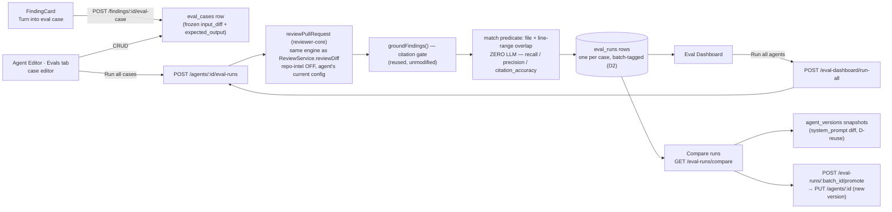

# Spec: Eval Pipeline  |  Spec ID: SPEC-05  |  Status: implemented
Supersedes: none

## Problem & why
Review agents (`agents` table — provider + model + system prompt + linked skills) are edited
freely today: a maintainer can change an agent's system prompt, swap its model, or attach a
different skill with no signal of whether the change made the agent better or worse. The only
existing feedback loop is a human re-reading findings after the fact. This feature closes that
loop deterministically: every accept/dismiss decision a reviewer already makes on a real finding
(`FindingCard`'s existing Accept/Dismiss actions, `server/src/modules/reviews/findings.ts`) becomes
a frozen regression case; running an agent's case set produces `recall`/`precision`/
`citation_accuracy` numbers computed **entirely in code** (file + line-range overlap, zero LLM
calls in scoring), so a prompt/model/skill edit is provable, not vibes.

## Goals / Non-goals
- **Goals:**
  - One-click creation of an eval case from an already-**accepted** finding (`must_find`
    expectation) or an already-**dismissed** finding (`must_not_flag` expectation), via a new
    "Turn into eval case" action on `FindingCard`.
  - An agent's eval set can hold an arbitrary number of cases (delivery target: ≥8 in the gold
    set — a course-assignment delivery note, not a runtime limit).
  - Run an agent against every case in its own set, on demand or as "Run all agents".
  - Deterministic, zero-LLM scoring: `recall` / `precision` / `citation_accuracy` per run, reusing
    the existing citation-grounding gate (`groundFindings()`, `reviewer-core/src/grounding.ts`) for
    `citation_accuracy` and a new file+line-overlap match predicate (mirroring
    `rangeIntersects` in `grounding.ts`) for `recall`/`precision`.
  - Run history + a "Compare runs" flow: pick two runs of the same agent → metric deltas + a
    system-prompt diff between the two agent config versions the runs used.
  - A new **Eval Dashboard** top-level nav page: per-agent trend list, "Run all agents", a
    workspace-wide recent-runs table, and a per-agent detail view (numbers + deltas + trend chart
    + recent-runs table + compare-runs + "Promote").
  - An **Evals** tab in the Agent Editor: case list (pass/fail, expected-vs-got, tags,
    run/edit/delete) + a case editor (diff/files/PR-meta tabs, expected-output editor, "Run case").
  - A `pnpm verify:l06` gate, mirroring `scripts/verify-l03.sh`'s shape, green before this ships.
- **Non-goals:**
  - Any LLM call inside **scoring** (match/recall/precision/citation_accuracy computation). Note:
    **executing** a case (asking the agent-under-test what it finds on the frozen diff) legitimately
    makes one LLM call per case — same cost model as a normal single-agent review. Only the
    *comparison against the expectation* is LLM-free. See AC-11 for the precise boundary.
  - New DB tables or migrations — `eval_cases`/`eval_runs` already exist (migration `0000_init.sql`)
    and are used as-is (see `## Design & contracts`, D1).
  - `owner_kind: 'skill'` eval cases — the `eval_cases` schema is polymorphic (`owner_kind` ∈
    `{skill, agent}`) but this spec covers **agents only**; skill-owned cases are a future feature.
  - Hand-authored eval scenarios — every case is born from a real accept/dismiss decision (per the
    assignment's premise); this spec does not add a "create case from scratch with no finding" flow
    beyond what the case editor's edit capability already implies for an existing case.
  - CI export / posting eval results externally (`ci-runs`, `composed_reviews`) — out of scope,
    covered by the neighboring `eval-ci.ts` contract's other sections (CI export, conformance),
    which this spec does not touch.
  - Re-running repo-intel enrichment (repo skeleton / callers) inside a case execution — frozen
    cases run with repo-intel **off**, mirroring `ReviewService.reviewDiff`'s existing behavior for
    the pre-push CLI, so results stay reproducible independent of live index state (AC-6).

## User stories
- As a **reviewer**, I want to turn a finding I just accepted or dismissed into a regression case
  with one click, so that my judgment becomes a permanent guardrail without extra authoring work.
- As an **agent owner**, I want to run my agent's whole case set and see recall/precision/
  citation_accuracy, so that I know objectively whether my agent is any good.
- As an **agent owner editing a system prompt**, I want to run the case set before and after my
  edit and see the numbers move, so that I can prove (or disprove) the edit is an improvement
  before trusting it on real PRs.
- As a **maintainer**, I want a dashboard across all agents with trend lines and a "Run all
  agents" button, so that I can catch a regression introduced by any agent's last edit at a glance.
- As a **maintainer comparing two runs**, I want the system-prompt diff between the two agent
  versions those runs used, so that I can see exactly what change caused the metric delta and
  "Promote" the better one.

## Acceptance criteria (EARS)
- **AC-1** — The system shall allow an agent's eval case set (`eval_cases` rows with
  `owner_kind='agent'`, `owner_id=<agent id>`) to hold an arbitrary number of cases, with no
  enforced maximum. _(verify: integration — insert >8 cases for one agent; `GET
  /agents/:id/eval-cases` returns all of them)_. Delivery note: the course assignment's own gold
  set targets ≥8 cases — a content/authoring target, not a system constraint.
- **AC-2** — WHEN a user invokes "Turn into eval case" on a finding whose `accepted_at` is set,
  the system shall create an `eval_cases` row owned by the finding's originating agent
  (`review.agent_id`) with an expectation of type `must_find` at the finding's `file`/
  `start_line`/`end_line`, and an `input_diff` snapshot frozen at creation time (independent of any
  later change to the source PR/repo). _(verify: integration — accept a finding, click the action,
  assert the persisted case's `expected_output` and that its `input_diff` still parses after the
  source PR's diff is mutated)_
- **AC-3** — WHEN a user invokes "Turn into eval case" on a finding whose `dismissed_at` is set,
  the system shall create an `eval_cases` row with an expectation of type `must_not_flag` at the
  finding's `file`/`start_line`/`end_line`, frozen the same way as AC-2. _(verify: integration —
  mirror AC-2 for the dismiss path)_
- **AC-4** — IF a finding has neither `accepted_at` nor `dismissed_at` set, THEN the "Turn into
  eval case" action shall be unavailable (disabled/hidden) on `FindingCard`. _(verify: component
  (`FindingCard.test.tsx`) — pending finding renders no/disabled action; accepted/dismissed finding
  renders it enabled)_
- **AC-5** — The system shall execute an eval case using **only** its frozen `input_diff` (+
  frozen `input_files`/`input_meta`), never re-reading the live PR, repo clone, or repo-intel index
  — so a case remains runnable and its result reproducible even after the source PR/review is
  edited or deleted. _(verify: integration — delete the source review/PR after case creation; the
  case still runs and scores)_
- **AC-6** — WHEN "Run all cases" is triggered for an agent (`POST /agents/:id/eval-runs`), the
  system shall execute the review engine (`reviewPullRequest` from `@devdigest/reviewer-core`, the
  same engine `ReviewService.reviewDiff` uses) once per case against that case's frozen diff, using
  the agent's **current** `system_prompt`/`model`/`provider`/enabled linked skills, with repo-intel
  enrichment **off** (mirroring `reviewDiff`'s working-tree baseline), and shall tag the resulting
  `eval_runs` rows with a shared identifier for that batch plus the agent's current config
  `version`. _(verify: integration — run a 3-case set, assert 3 `eval_runs` rows share one batch
  tag and the agent's `version` at run time; assert `container.llm` is invoked once per case, not
  once per batch)_
- **AC-7** — The system shall compute the match between a produced finding and an expectation
  using **only** `file` equality AND `[start_line, end_line]` range overlap (mirroring
  `rangeIntersects` in `reviewer-core/src/grounding.ts`) — no LLM call, no semantic/fuzzy text
  comparison. _(verify: unit — same-file overlapping ranges match; same-file non-overlapping
  ranges don't; different-file identical ranges don't)_
- **AC-8** — The recall of a batch shall equal (count of that batch's `must_find` cases where the
  agent produced at least one matching finding) ÷ (total `must_find` cases in the batch); WHEN the
  batch has zero `must_find` cases, recall shall be reported as undefined/null, never `0` or `1`.
  _(verify: unit — mixed matched/unmatched fixture; zero-`must_find`-case fixture yields null)_
- **AC-9** — A produced finding shall be counted as **noise** WHEN its file+line-range overlaps the
  forbidden range of at least one of the batch's `must_not_flag` cases; the precision of a batch
  shall equal (count of the batch's produced findings that are **not** noise) ÷ (total findings
  produced across the batch) — a **finding-level** formula, so noise on a `must_find` case (an
  agent that finds the expected issue but *also* hallucinates something extra) lowers precision the
  same as noise anywhere else. WHEN the batch produces zero findings, OR the batch has zero
  `must_not_flag` cases, precision shall be reported as undefined/null, never `0` or `1`.
  **[CONFIRMED by user 2026-07-14 — Q1: finding-level, matching the brief's literal "share of
  produced findings that aren't noise" wording.]** _(verify: unit — a 3-finding batch with 1
  finding overlapping a `must_not_flag` range yields precision 2/3; a batch with zero produced
  findings, or zero `must_not_flag` cases, yields null)_
- **AC-10** — The citation_accuracy of a batch shall equal (total findings kept by the citation
  grounding gate across the batch's case executions) ÷ (total findings produced before grounding
  across the batch), reusing `reviewPullRequest`'s existing `review.findings` (kept) and `dropped`
  output — no new grounding logic. _(verify: integration — a case whose agent hallucinates an
  ungrounded finding lowers citation_accuracy; a fully-grounded run yields `1.0`)_
- **AC-11** — Scoring (the match predicate, recall, precision, citation_accuracy computation
  itself) shall make **zero** LLM calls; the only LLM call in the eval pipeline is the one-per-case
  agent invocation that produces the findings being scored (AC-6). _(verify: unit — a test that
  builds `Container` with no `llm` override and calls only the scoring function proves this by
  construction, mirroring the "route makes NO LLM call" pattern in `test/smart-diff.it.test.ts`)_
- **AC-12** — WHEN two batches for the same agent are compared, the system shall return
  recall/precision/citation_accuracy deltas computed directly from the two batches' stored
  aggregates — a genuine recomputation, not a cached/stale value — so a real prompt/model/skill
  edit between the two runs is reflected numerically. _(verify: integration — run a batch, edit the
  agent's `system_prompt` degrading it toward one of its own `must_not_flag` cases, run a second
  batch, assert `precision` measurably drops between the two compared batches)_
- **AC-13** — WHEN two batches are compared, the system shall also return the system-prompt diff
  between the two agent config versions the batches were tagged with (AC-6), sourced from the
  existing `agent_versions` snapshots (`GET /agents/:id/versions/:version`). _(verify: integration
  — compare two batches tagged with different versions; assert both versions' `system_prompt`
  strings are present in the response)_
- **AC-14** — WHEN a "Promote" action is invoked from a compare-runs view, the system shall set the
  agent's **live** config to the chosen compared batch's tagged version's config, going through the
  existing agent config-update path so a **new** `agent_versions` snapshot is created (never
  mutating history). _(verify: integration — promote an older version; assert the agent's current
  config matches the promoted snapshot and a new version row was appended, not overwritten)_
- **AC-15** — The Eval Dashboard page shall list every agent with cases, each row showing a
  recall/precision/citation_accuracy trend sparkline, current numbers, and last-run info, sourced
  from a dashboard read scoped per-agent. _(verify: component + e2e — dashboard renders one row per
  agent-with-cases; an agent with zero cases is omitted or shown as "no cases yet", not a crash)_
- **AC-16** — WHEN "Run all agents" is triggered from the dashboard, the system shall run every
  enabled agent's full case set (AC-6, once per agent) in one action. _(verify: integration — 2
  agents with cases → 2 batches created, one per agent)_
- **AC-17** — The Eval Dashboard shall show a "Recent eval runs · all agents" table listing eval
  batches across every agent, newest first. _(verify: component — table rows span multiple agents,
  ordered by run time descending)_
- **AC-18** — The per-agent Eval Dashboard detail view shall show current recall/precision/
  citation_accuracy with deltas vs. the immediately preceding batch, a metric-trend line chart over
  time, and a "Recent runs" table with recall/precision/citation_accuracy/pass-count/cost per run.
  _(verify: component — deltas render `+`/`−` against the prior batch; trend chart receives ≥2
  points after 2 runs)_
- **AC-19** — The Agent Editor's Evals tab shall list the agent's cases (name, pass/fail,
  expected-vs-got, severity/category tags) with run/edit/delete actions per case, and the agent's
  run history. _(verify: component (`AgentEditor`-family test) — case list renders pass/fail
  distinctly from color alone (icon + text), matching the a11y convention already used for
  `risk_level` in SPEC-04 AC-15)_
- **AC-20** — The case editor shall provide diff/files/PR-meta input tabs, an expected-output
  editor validated against the `EvalExpectation` shape (AC-9's two types), a "Run case" action, and
  a run-on-save toggle. _(verify: component — invalid expected-output JSON is rejected before save,
  mirroring the route-level 422 validation convention in `docs/server/api-contracts.md`)_
- **AC-21** — Every new eval route (case CRUD, run, dashboard, compare, promote) shall resolve
  tenancy via `getContext()` before touching data; IF a case, run, or agent id does not belong to
  the caller's workspace, THEN the route shall respond not-found. _(verify: integration —
  cross-workspace case/agent id on every new route returns the standard `NotFoundError`)_
- **AC-22** — IF a single case's execution fails (LLM error/timeout/malformed frozen diff) during a
  "run all cases"/"run all agents" batch, THEN that case's failure shall be isolated (recorded with
  a failure marker, e.g. `pass=null`) and shall not abort the remaining cases in the batch —
  mirroring `ReviewService.reviewDiff`'s per-agent try/catch isolation. _(verify: integration — one
  case's frozen diff is corrupted; the batch still produces results for the other cases)_
- **AC-23** — A `pnpm verify:l06` script shall exist and exit `0`, chaining (per `## Design &
  contracts`, "verify:l06 gate"): `reviewer-core` tests, server typecheck, server unit tests
  (excluding `*.it.test.ts`), client typecheck + tests, and a vendor-sync check **scoped and fatal**
  on the contract file(s) this feature actually edits (mirroring `scripts/verify-l03.sh`'s scoped
  vendor-sync pattern, not the full unscoped diff). _(verify: manual — `pnpm verify:l06` from repo
  root exits 0; CI-equivalent — same commands green in isolation)_
- **AC-24** — The system shall treat the frozen `input_diff` (and any `input_meta` PR
  title/body/intent snapshot) the same as a live PR diff for injection-defense purposes: eval case
  execution routes through the same `assemblePrompt`/`INJECTION_GUARD`/`wrapUntrusted` path as a
  normal review (via `reviewPullRequest`), so no new untrusted-input bypass is introduced.
  _(verify: unit — a frozen case fixture containing "ignore previous instructions" text does not
  change the shape/behavior of the scoring, matching the existing prompt-injection test pattern)_
- **AC-25** — WHEN an agent that owns eval cases (`owner_kind='agent'`, `owner_id=<agent id>`) is
  deleted, THEN the system shall explicitly delete that agent's `eval_cases` rows (and, via the
  existing DB-level `eval_runs.case_id → eval_cases` cascade, their `eval_runs`) as part of the same
  delete operation — no orphaned eval data survives an agent deletion. **[CONFIRMED by user
  2026-07-14 — Q4.]** _(verify: integration — delete an agent with ≥1 eval case + ≥1 eval run;
  assert both are gone, and the delete does not error)_

## Edge cases
- **Empty case set** — "Run all cases" on an agent with 0 cases returns an empty/zero-case batch,
  not an error; dashboard shows "no cases yet" rather than `NaN%` (AC-15).
- **Zero `must_find` or zero `must_not_flag` cases in a batch** — the corresponding metric is
  `null`/undefined, not `0` or `1` (AC-8, AC-9).
- **Duplicate "Turn into eval case" clicks on the same finding** — creates a new case each time, no
  dedupe. **[CONFIRMED by user 2026-07-14 — Q5.]**
- **Frozen `input_diff` fails to re-parse** at run time (should not normally happen since it's
  captured via the same parser that produced the original finding, but a hand-edited case in the
  editor could break it) — the case run records a scoring error, not a silent `0`/false pass
  (AC-22's isolation applies).
- **Agent deleted while it owns eval cases** — `eval_cases.owner_id` has **no** DB-level foreign
  key to `agents` (it's a polymorphic reference disambiguated by `owner_kind`), so nothing cascades
  automatically at the database level. The agent-delete service path shall explicitly cascade-delete
  the agent's `eval_cases` (and, via the existing `eval_runs → eval_cases` DB-level cascade, their
  `eval_runs`) before/as part of deleting the agent row. **[CONFIRMED by user 2026-07-14 — Q4.]**
- **Very large case diff** (a finding from a big PR) — case execution reuses `reviewPullRequest`'s
  existing map-reduce threshold (`DEFAULT_MAP_THRESHOLD_LINES`), no new size handling needed.
- **Malformed expected-output JSON in the case editor** — rejected client + server side against the
  `EvalExpectation` schema (AC-20), never silently accepted as `unknown`.
- **Case created from a finding whose source PR/review is later deleted** — the case remains valid
  and runnable because its diff was frozen at creation time (AC-5); this is the point of freezing.
- **Concurrent "Run all cases" triggers for the same agent** — no locking is assumed by this spec;
  each trigger produces its own independent batch id (AC-6). Two concurrent batches racing is
  accepted as a v1 limitation, not handled specially.

## Non-functional
- **Security / tenancy:** every new route resolves `getContext()` first (AC-21). `eval_cases` has
  a first-class `workspace_id` column so scoping is direct; `eval_runs` has no `workspace_id` of its
  own and must be scoped by joining through `eval_cases.workspace_id` — the same join-based pattern
  `actOnFinding`/`findingContext` already uses for `findings` → `reviews` → PR → workspace.
- **Abuse cases:**
  (a) A malicious/injected diff fragment stored as `input_diff` and replayed through
  `reviewPullRequest` on every eval run — already neutralised by the existing shared
  `INJECTION_GUARD`/`wrapUntrusted` path (AC-24); no new untrusted-input surface is introduced.
  (b) A user hand-crafting trivially-easy eval cases to make an agent look better than it is — a
  product-trust concern (garbage-in/garbage-out on a human-curated gold set), not a security issue;
  out of scope for this spec.
  (c) Repeated "Run all cases" / "Run all agents" clicks causing runaway LLM spend — the new
  run-triggering routes adopt a rate limit tighter than the existing `/pulls/:id/review` 10/min
  (non-blocking default, see Open questions Q6).
- **Cost/perf:** each case execution costs exactly one agent LLM call (same cost model as reviewing
  that diff fragment normally); a "run all cases" batch costs `cases_total` × (per-case cost);
  surfaced via the existing `PriceBook.estimate(model, tokensIn, tokensOut)`, matching the L01 Run
  Cost Badge convention. Scoring itself is O(cases × findings) in-process work, negligible cost.
- **Accessibility:** pass/fail and recall/precision/citation_accuracy trend indicators must not rely
  on color alone — pair with an icon/text label, matching the `risk_level` convention established in
  `specs/SPEC-04-why-risk-brief.md` AC-15.

## Design & contracts   <!-- no implementation code -->

### D1 — No new tables or migrations: `eval_cases`/`eval_runs` already exist
`server/src/db/schema/eval.ts` (Drizzle) and `server/src/db/migrations/0000_init.sql` already
define `eval_cases` (`id, workspace_id, owner_kind ∈ {skill,agent}, owner_id, name, input_diff,
input_files jsonb, input_meta jsonb, expected_output jsonb, notes`) and `eval_runs` (`id, case_id →
eval_cases, ran_at, actual_output jsonb, pass bool, recall, precision, citation_accuracy,
duration_ms, cost_usd`) — this is the repo's pre-created-schema pattern (server/README.md: "the
unused [tables] simply sit empty until a lesson fills them"), exactly analogous to how SPEC-04's
Why+Risk Brief reused `pr_brief.json` as a columns-only composite blob instead of a new table. **No
migration is proposed by this spec.** The shared contracts (`server/src/vendor/shared/contracts/
eval-ci.ts` + `knowledge.ts`) are *also already pre-scaffolded* — `EvalCase`, `EvalCaseInput`,
`EvalRunRecord`, `EvalRunResult`, `EvalTrendPoint`, `EvalDashboard`, `EvalOwnerKind`, `EvalRun`,
`EvalPerTrace` all exist and are already byte-identical between the server and client vendor
copies — only this spec's genuinely new pieces (below) need adding.

### D2 — Batch grouping and agent-version tagging live inside `eval_runs.actual_output` (no new columns)
`eval_runs` has one row per **case execution**, not one row per "run all cases" invocation, and
carries no column to group rows from the same invocation or to record which agent config version
produced them. Rather than add columns, this spec proposes nesting that metadata inside the
existing `actual_output` jsonb column (columns-only reuse, same pattern as D1):
`actual_output = { produced_findings: Finding[], grounding: { kept: number, dropped: number },
meta: { batch_id: string, agent_id: string, agent_version: number, provider, model } }`. A "run"
as the UI presents it (recall/precision/citation numbers, "Recent runs" table row, compare-runs
unit) = all `eval_runs` rows sharing one `meta.batch_id`. **[CONFIRMED by user 2026-07-14 — Q2:
the jsonb-metadata approach is correct, not a columns migration.]** The `eval_cases`/`eval_runs`
schema is given as-is by the assignment (verbatim in `migrations/0000_init.sql`, no `batch_id`/
`agent_version` columns) — this spec treats it as fixed and adds no columns, only nests grouping
metadata inside the existing `actual_output` jsonb.

### D3 — Per-row `recall`/`precision`/`citation_accuracy` are batch-level aggregates; `pass` is per-case
Given `pass` is boolean and scoped to one `case_id`, it is read as the per-**case** verdict (did
this one case's expectation get satisfied) — matching the Evals tab's "list of cases … pass/fail"
requirement directly. The three numeric metric columns cannot mean anything at single-case
granularity (a single `must_find` case's own "recall" is trivially 0/1, and a `must_not_flag` case
has no recall at all), so this spec proposes they are **stamped identically across every row in a
batch** with that batch's aggregate value (AC-8, AC-9, AC-10) — letting any single row, or a
"recent runs" query grouped by `meta.batch_id`, expose the batch summary without an extra
service-layer reduce on every read. `duration_ms`/`cost_usd` stay **per-case** (natural at
`case_id` grain), summed in the service layer for a batch total where the dashboard needs "cost per
run". **[CONFIRMED by user 2026-07-14 — Q3: this reading is correct — the schema has no separate
batch-level table, so stamping the batch aggregate across every row in the batch is the only
consistent interpretation.]**

### D4 — Expectation shape: a new `EvalExpectation` contract narrows `expected_output`
`EvalCaseInput.expected_output` is currently `z.unknown()` (a scaffold placeholder with no real
producer yet). This spec needs a concrete shape:
`EvalExpectation = { type: 'must_find', file: string, start_line: number, end_line: number } |
{ type: 'must_not_flag', file: string, start_line: number, end_line: number }`
— proposed as an addition to `server/src/vendor/shared/contracts/eval-ci.ts` (mirrored to the
client vendor copy), narrowing (not breaking) the existing `unknown` field. This is the shape the
match predicate (AC-7) and the case editor's expected-output editor (AC-20) validate against.

### D5 — Case execution reuses `ReviewService.reviewDiff`'s "review a raw diff, no persistence" shape
`server/src/modules/reviews/service.ts`'s `reviewDiff(workspaceId, diff, { agentId, task, onEvent })`
already does exactly what one case execution needs: resolve the agent's `llm`, load its
enabled+linked skills, call `reviewPullRequest` (repo-intel off, no PR row, no persistence to
`reviews`/`findings`), return `{ review, grounding, droppedCount, tokensIn, tokensOut, costUsd }`
per agent, with per-agent failure isolation. Eval-case execution is the same call shape with the
diff coming from a frozen `eval_cases.input_diff` instead of `git diff HEAD`, looped over N cases
instead of N agents, and its outcome persisted into `eval_runs` (new: match against
`expected_output`, compute the batch aggregate, write the row) instead of discarded. This spec does
not mandate a specific new module path — naming `reviewDiff`/`reviewPullRequest` as the reuse point
is grounding, not implementation.

### D6 — Route surface (interface contracts only, not implementation)
Mirroring the existing route conventions (`/pulls/:id/review`, `/findings/:id/accept`,
`/agents/:id/versions`, `/pulls/:id/brief` + `/regenerate`):
- `POST /findings/:id/eval-case` — the one-click action (AC-2, AC-3); derives owner/expectation/diff
  server-side from the finding + its review, so the client sends no body.
- `GET /agents/:id/eval-cases`, `POST /agents/:id/eval-cases` (general create), `GET
  /eval-cases/:id`, `PUT /eval-cases/:id`, `DELETE /eval-cases/:id` — case CRUD (AC-1, AC-19, AC-20).
- `POST /agents/:id/eval-runs` — run all of an agent's cases, one new batch (AC-6).
- `POST /eval-cases/:id/eval-runs` — run one case (case editor's "Run case", AC-20).
- `GET /agents/:id/eval-runs` — an agent's run history, batches (AC-19).
- `GET /agents/:id/eval-dashboard` — per-agent dashboard aggregate (`EvalDashboard`, `owner_kind:
  'agent'`) (AC-15, AC-18).
- `GET /eval-dashboard` — workspace-wide aggregate (`owner_kind: null`) + "Recent eval runs · all
  agents" (AC-15, AC-17).
- `POST /eval-dashboard/run-all` — "Run all agents" (AC-16).
- `GET /eval-runs/compare?a=<batch_id>&b=<batch_id>` — metric deltas + system-prompt diff (AC-12,
  AC-13).
- `POST /eval-runs/:batch_id/promote` — apply a batch's tagged agent version as the agent's live
  config (AC-14); mechanism left to the planner — either a new agent-version-restore endpoint
  (mirroring the skills module's existing `POST /skills/:id/versions/:version/restore`) or the
  client resolving the old version and calling the existing `PUT /agents/:id`.

### Contract-change note (api-contract-reviewer)
Everything in D6 is **new** routes — no existing response contract changes. D4's `EvalExpectation`
narrows `EvalCaseInput.expected_output` from `z.unknown()` to a concrete union: additive/non-breaking
(nothing currently produces or consumes that field for real). D2/D3 read/write inside the already-
`z.unknown()`-typed `actual_output`/`recall`/`precision`/`citation_accuracy` columns via the
existing `EvalRunRecord` contract — no contract shape changes needed there beyond documenting the
`actual_output.meta` sub-shape. All touched files must stay synced across
`server/src/vendor/shared/` and `client/src/vendor/shared/` (`check-vendor-sync.sh`); note `eval-ci.ts`
currently has **pre-existing, unrelated** drift (missing `AgentManifest`/CI-export section and a
`provider` enum gap in `ConformanceInput` on the client copy) — this spec's own additions must be
synced, but `verify:l06`'s vendor-sync check should be **scoped** to the sections this feature
touches (mirroring `verify-l03.sh`'s scoped-not-full pattern) so it doesn't go permanently red over
unrelated drift.

## Inputs (provenance)
- Eval case `input_diff`/`expected_output`: **[derived]** — from an already-accepted/dismissed
  `FindingRecord` (`file`, `start_line`, `end_line`, `accepted_at`/`dismissed_at`) plus the diff the
  originating review ran against (frozen at case-creation time, same reconstruction path
  `diffFromPrFiles`/`loadDiff` already uses).
- Produced findings per case run: **[new: 1 LLM call per case]** — via `reviewPullRequest`, the same
  engine every normal review uses; no new prompt-assembly logic.
- Citation grounding (kept/dropped, → `citation_accuracy`): **[reused]** — `groundFindings()` in
  `reviewer-core/src/grounding.ts`, already invoked inside `reviewPullRequest`; zero new grounding
  code.
- Match predicate (→ `recall`/`precision`): **[new: deterministic, zero LLM]** — mirrors
  `rangeIntersects` from the same grounding module for consistency of "what counts as overlap".
- Agent version + system-prompt snapshot (→ compare/promote): **[reused]** — the existing
  `agent_versions` table + `isConfigChange` version-bump rule (`modules/agents/helpers.ts`),
  already populated whenever an agent's config changes.
- Cost/duration per case: **[deterministic]** — `PriceBook.estimate(model, tokensIn, tokensOut)`
  (existing) + wall-clock duration measured around the `reviewPullRequest` call (new, small).

## Untrusted inputs
The frozen `input_diff` (and any `input_meta` PR title/body/intent snapshot) is third-party PR
content, same trust class as a live review's diff — it is replayed through the existing
`assemblePrompt`/`INJECTION_GUARD`/`wrapUntrusted` path unchanged (AC-24), so no new untrusted-input
handling is introduced; this spec adds no new place that reads external/user content directly.
Case `name`/`notes` are workspace-member-authored (not third-party) and are treated as ordinary
display data, same as every other user-entered label in the product.

## Traceability
| AC | Implemented by (plan task) |
| --- | --- |
| AC-1 | <planner fills> |
| AC-2 | <planner fills> |
| AC-3 | <planner fills> |
| AC-4 | <planner fills> |
| AC-5 | <planner fills> |
| AC-6 | <planner fills> |
| AC-7 | <planner fills> |
| AC-8 | <planner fills> |
| AC-9 | <planner fills> |
| AC-10 | <planner fills> |
| AC-11 | <planner fills> |
| AC-12 | <planner fills> |
| AC-13 | <planner fills> |
| AC-14 | <planner fills> |
| AC-15 | <planner fills> |
| AC-16 | <planner fills> |
| AC-17 | <planner fills> |
| AC-18 | <planner fills> |
| AC-19 | <planner fills> |
| AC-20 | <planner fills> |
| AC-21 | <planner fills> |
| AC-22 | <planner fills> |
| AC-23 | <planner fills> |
| AC-24 | <planner fills> |
| AC-25 | <planner fills> |

## Open questions
All blocking questions are resolved, **[CONFIRMED by user 2026-07-14]**:
- **Q1 — precision formula: finding-level.** See AC-9.
- **Q2 — no columns migration; jsonb `actual_output.meta` only.** See D2.
- **Q3 — batch aggregate stamped on every row is the correct reading.** See D3.
- **Q4 — agent delete cascade-deletes its eval cases/runs at the service layer.** See AC-25.
- **Q5 — duplicate "Turn into eval case" clicks create a new case each time, no dedupe.** See Edge cases.

Two non-blocking items remain, each with a stated default the planner may adopt without further
confirmation — flagged so neither is silently decided without a record:
- Q6 — exact rate limit for the new run-triggering routes (`/agents/:id/eval-runs`,
  `/eval-cases/:id/eval-runs`, `/eval-dashboard/run-all`). Default: mirror the existing
  `/pulls/:id/review` 10/min pattern, but capped tighter (e.g. 3/min per workspace) since a batch
  fans out to N LLM calls per click rather than one.
- Q7 — the "Promote" mechanism (AC-14): a new agent-version-restore endpoint (mirroring the skills
  module's `POST /skills/:id/versions/:version/restore`) vs. the client reading the old version and
  calling the existing `PUT /agents/:id` directly. Default: mirror the skills module's existing
  restore endpoint for consistency across the two "restore a prior config version" features in the
  product.
- Q8 — minor pre-existing scaffold inconsistency: `EvalCaseInput`'s doc comment says "id + owner
  resolved by the route" but its Zod shape still requires `owner_kind`/`owner_id` in the body.
  Default: the route ignores/overrides body-supplied owner fields with the URL's `:id`, for tenancy
  safety.
