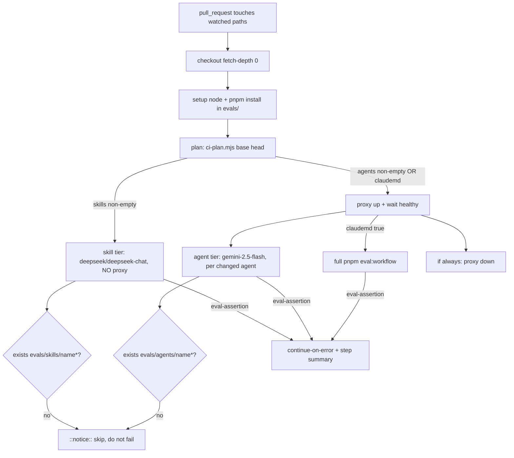

# Spec: harness-self-check  |  Spec ID: SPEC-01  |  Status: draft
Supersedes: none

> Note: the repo has no prior `specs/` and no `SPEC-*.md`, so this is the first spec
> (global number `01`) and it establishes the repo-root `specs/` location. The filename
> follows the task's explicit request (`specs/harness-self-check.md`) rather than the
> default `SPEC-NN-<slug>.md`; the Spec ID above is the traceability handle.

## Problem & why
The eval harness (`evals/`) can grade a skill, an agent, or workflow-level routing, but
nothing forces those evals to actually run when the graded artifact changes. Today a
contributor must *remember* to run the right eval before committing, and a contributor
who doesn't know the convention has no safety net at all. This closes the loop two ways:
a written self-check rule inside `AGENTS.md` so the next Claude Code session knows what
to run, and a CI workflow that enforces the same checks on every PR that touches a
skill, an agent, or an `AGENTS.md`.

## Goals / Non-goals
- **Goals:**
  - **Part 1 (local loop):** add an eval-commands block to `## Commands` and a new
    `## Self-check before commit` section (a change→eval table) to the real root
    `AGENTS.md`.
  - **Part 2 (CI loop):** a new `.github/workflows/harness-evals.yml` that, on every PR
    touching `.claude/skills/**`, `.claude/agents/**`, or any `AGENTS.md`, runs *only*
    the eval(s) for the changed artifact(s) — skipping (never failing) when no eval
    exists yet — and runs the full `pnpm eval:workflow` when any `AGENTS.md` changed.
  - A standalone helper `evals/scripts/ci-plan.mjs <base_ref> <head_ref>` that diffs two
    refs and emits which skills / agents / `AGENTS.md`-changed as GitHub Actions step
    outputs, and is also runnable locally for a dry-run preview.
  - Per-tier model selection wired purely as workflow-YAML `env:` values, reusing the
    existing `OPENROUTER_API_KEY` GitHub secret.
- **Non-goals:**
  - **Not** authoring new eval cases for the ~16 skills / ~9 agents that lack them —
    "no eval yet" is an expected, non-failing state.
  - **Not** modifying harness engine code (`evals/src/**`, `evals/proxy/**`,
    `evals/scripts/litellm-proxy.sh`) — model choice is env-only per
    `evals/src/config.ts:9-10`.
  - **Not** editing the five `CLAUDE.md` symlinks; only the real `AGENTS.md` files.
  - **Not** adding any new secret, and **not** surfacing anything in any product UI.
  - **Not** accepting external fork contributions — this is a personal/course repo, so
    the CI loop targets same-repo PRs (fork PRs cleanly skip the model tiers, see AC-25).
  - **Not** touching `server/`, `client/`, or `reviewer-core/` product code, DB schema,
    or migrations.

## User stories
- As a **contributor editing a skill/agent/AGENTS.md**, I want the exact command to run
  before committing spelled out in `AGENTS.md`, so that I don't have to remember the
  harness convention.
- As a **future Claude Code session**, I want a machine-readable self-check rule in the
  file I already read at session start, so that I eval a changed artifact before
  committing without being told.
- As a **maintainer reviewing a PR**, I want CI to run the eval for exactly the changed
  artifact(s) and clearly skip the rest, so that I get signal without paying for or
  waiting on the whole suite.
- As a **developer**, I want to run `node evals/scripts/ci-plan.mjs origin/main HEAD`
  locally, so that I can preview which evals CI will run before I push.

## Acceptance criteria (EARS)

### Part 1 — `AGENTS.md` self-check rule
- **AC-1** — The root `AGENTS.md` `## Commands` block **shall** list the four eval
  commands `eval:quality`, `eval:skills`, `eval:agents`, and `eval:workflow` (each with
  a one-line description of what it checks).
  _(verify: manual inspection — grep the four command names appear under `## Commands`)_
- **AC-2** — The root `AGENTS.md` **shall** contain a new `## Self-check before commit`
  section containing a "what you changed → which eval to run" table.
  _(verify: manual inspection — the heading and a Markdown table are present)_
- **AC-3** — The self-check table **shall** map a `.claude/skills/<name>/**` change to a
  scoped skill eval, a `.claude/agents/<name>.md` change to a scoped agent eval, and a
  `CLAUDE.md`/`AGENTS.md` change to the full `pnpm eval:workflow`.
  _(verify: manual inspection — three rows with the three mappings)_
- **AC-4** — WHERE a changed skill/agent has no eval directory yet, the self-check rule
  **shall** instruct the reader to skip (not fail) that scoped eval.
  _(verify: manual inspection — the "skip if `evals/…/<name>*/` doesn't exist" clause is present)_
- **AC-5** — The self-check rule content **shall** be written only to the real
  `AGENTS.md` file; the five `CLAUDE.md` symlinks **shall not** be modified as files.
  _(verify: manual inspection — `git diff` touches `AGENTS.md`, no `CLAUDE.md` blob change)_
- **AC-6** — The `## Self-check before commit` section **shall** state that
  `.github/workflows/harness-evals.yml` enforces the same checks in CI, identifying the
  table as the local mirror of that workflow (single source of truth, not a fork).
  _(verify: manual inspection — a sentence cross-referencing the CI workflow is present)_

### Part 2 — `ci-plan.mjs` helper
- **AC-7** — WHEN `ci-plan.mjs` is invoked with two git refs, it **shall** compute
  changed files via `git diff --name-only <base> <head>` and emit three named results:
  `skills` (JSON array of names), `agents` (JSON array of names), and `claudemd`
  (boolean).
  _(verify: unit/CLI — run against a fixture ref pair, assert the three emitted values)_
- **AC-8** — The `skills` result **shall** be the distinct set of `<name>` extracted from
  every changed path matching `.claude/skills/<name>/…` (nested paths like
  `.claude/skills/<name>/references/x.md` collapse to `<name>`).
  _(verify: CLI — diff touching two files under one skill yields a single-element array)_
- **AC-9** — The `agents` result **shall** be the distinct set of `<name>` extracted from
  every changed path matching `.claude/agents/<name>.md`, with the `.md` suffix stripped.
  _(verify: CLI — a changed `.claude/agents/brainstorm.md` yields `["brainstorm"]`)_
- **AC-10** — The `claudemd` result **shall** be `true` IF any changed path is a real
  `AGENTS.md` (root or any of `server/`, `reviewer-core/`, `client/`, `e2e/`), and
  **shall never** be driven by a `CLAUDE.md` path (which git never diffs, being a symlink).
  _(verify: CLI — a diff touching `server/AGENTS.md` yields `claudemd=true`; a synthetic
  `CLAUDE.md` path does not)_
- **AC-11** — WHEN `ci-plan.mjs` runs outside GitHub Actions (no `GITHUB_OUTPUT` in env),
  it **shall** print the same plan to stdout as a human-readable dry-run preview instead
  of writing step outputs, and **shall** exit 0.
  _(verify: CLI — run locally with `GITHUB_OUTPUT` unset, assert stdout preview + exit 0)_
- **AC-12** — WHEN `GITHUB_OUTPUT` is set, `ci-plan.mjs` **shall** append the three
  results as GitHub Actions step outputs in the `name=value` file format so downstream
  steps can consume them.
  _(verify: CLI — run with `GITHUB_OUTPUT` pointed at a temp file, assert the three
  `skills=`/`agents=`/`claudemd=` lines)_

### Part 2 — `harness-evals.yml` workflow
- **AC-13** — The workflow **shall** trigger on `pull_request` whose changed paths match
  `.claude/skills/**`, `.claude/agents/**`, any `AGENTS.md` (root and the four package
  `AGENTS.md`), or the workflow file itself.
  _(verify: manual inspection — `on.pull_request.paths` lists all of these)_
- **AC-14** — The checkout step **shall** use `fetch-depth: 0` so the plan step can diff
  the PR head against its base ref.
  _(verify: manual inspection — `actions/checkout` with `fetch-depth: 0`)_
- **AC-15** — WHEN the plan's `skills` result is non-empty, THEN the skill-tier step
  **shall** run with `EVAL_BACKEND=openrouter`, `EVAL_MODEL=deepseek/deepseek-chat`,
  `EVAL_JUDGE_MODEL=deepseek/deepseek-chat`, and **shall not** start the LiteLLM proxy
  (content tier is a direct OpenAI-compatible call).
  _(verify: manual inspection — env values on the conditional skills step, no proxy step in its path)_
- **AC-16** — For each changed skill `<name>`, IF a directory matching
  `evals/skills/<name>*` exists THEN the workflow **shall** run the scoped skill eval for
  it; ELSE it **shall** emit `::notice::no eval for skill '<name>' — skipping` and **shall
  not** fail the job.
  _(verify: e2e/CI — PR editing `.claude/skills/dependency-checker/**` runs its eval; a
  skill without an eval logs the notice and the job stays green)_
- **AC-17** — WHEN the plan's `agents` result is non-empty OR its `claudemd` result is
  `true`, THEN the tool-tier step **shall** start the LiteLLM proxy (`pnpm proxy:up`) and
  block until it is healthy before invoking any tool-tier eval, using
  `EVAL_BACKEND=openrouter`, `OPENROUTER_BASE_URL=http://localhost:4000`,
  `EVAL_MODEL=google/gemini-2.5-flash`, and `EVAL_JUDGE_MODEL=google/gemini-2.5-flash`.
  _(verify: manual inspection + CI — proxy step precedes the eval; env values match)_
- **AC-18** — For each changed agent `<name>`, IF a directory matching
  `evals/agents/<name>*` exists (prefix match, so variant suites like
  `evals/agents/architecture-reviewer-lite/` are found) THEN the workflow **shall** run
  its scoped agent eval; ELSE it **shall** emit
  `::notice::no eval for agent '<name>' — skipping` and **shall not** fail the job.
  _(verify: e2e/CI — a change to `architecture-reviewer.md` runs both the base and `-lite`
  suites; `brainstorm.md` logs the skip notice and stays green)_
- **AC-19** — IF the plan's `claudemd` result is `true`, THEN the workflow **shall** run
  the full `pnpm eval:workflow` suite unscoped (a single `AGENTS.md` change can affect
  routing anywhere).
  _(verify: e2e/CI — an `AGENTS.md`-only PR triggers the full workflow tier)_
- **AC-20** — The workflow **shall** tear the LiteLLM proxy down in an `if: always()`
  cleanup step so a failed eval never leaks a running container.
  _(verify: manual inspection — an `always()` `proxy:down` / `compose down` step exists)_
- **AC-21** — The workflow **shall** source `OPENROUTER_API_KEY` from
  `secrets.OPENROUTER_API_KEY` and **shall not** introduce any new secret.
  _(verify: manual inspection — only the existing secret is referenced)_
- **AC-22** — IF every changed skill/agent lacks an eval AND no `AGENTS.md` changed, THEN
  the job **shall** still conclude successfully (all-skip is a pass, not a no-op failure).
  _(verify: e2e/CI — a PR touching only eval-less artifacts is green)_
- **AC-23** — The workflow **shall** select per-tier models solely through
  `EVAL_MODEL`/`EVAL_JUDGE_MODEL` env vars per step, without editing
  `evals/src/config.ts` or any harness engine file.
  _(verify: manual inspection — model choice lives only in YAML `env:`)_
- **AC-24** — Skill/agent names derived from the PR diff are untrusted; WHEN a derived
  name is interpolated into a shell command or a `::notice::` line, the workflow (via
  `ci-plan.mjs`) **shall** constrain it to a safe name charset so a crafted path cannot
  inject shell commands.
  _(verify: unit/CLI — a diff introducing a path with shell metacharacters in the
  `<name>` segment is rejected or sanitized, not passed through verbatim)_
- **AC-25** — The workflow **shall** use the plain `pull_request` trigger (never
  `pull_request_target`, whose access to secrets while running attacker-controlled content
  is the prompt-injection risk this repo deliberately avoids). IF `OPENROUTER_API_KEY` is
  empty or unavailable (e.g. a fork PR, which GitHub scopes the secret out of), THEN each
  step that needs it **shall** skip with a `::notice::` and **shall not** fail the job —
  the same skip-not-fail pattern as a missing eval.
  _(verify: manual inspection + CI — `on:` uses `pull_request`; a run with an empty
  `OPENROUTER_API_KEY` logs the skip notice and the job stays green)_
- **AC-26** — Each eval-**assertion** step (skill tier, agent tier, workflow tier)
  **shall** be `continue-on-error: true` so a single flaky LLM judgment does not redden
  the PR, WHILE the job **shall** write a per-tier pass/fail line to
  `$GITHUB_STEP_SUMMARY` so the advisory signal is preserved and legible. Setup steps
  (checkout, `pnpm install`, the plan script, proxy startup) **shall not** be
  `continue-on-error` and **shall** hard-fail on error.
  _(verify: manual inspection — `continue-on-error: true` appears only on eval-assertion
  steps; a `$GITHUB_STEP_SUMMARY` write reports per-tier outcome; setup steps carry no
  such flag)_

## Edge cases
- **Renamed/deleted artifact:** a PR that deletes a skill/agent, or renames it, yields a
  `<name>` whose `evals/…/<name>*` no longer (or never did) exist → falls into the
  skip-with-notice path (AC-16/AC-18), must not fail. [NEEDS CLARIFICATION (non-blocking):
  should a *deleted* skill/agent be excluded from the plan entirely rather than
  attempted-then-skipped?]
- **Non-artifact path under a watched prefix:** a changed path like
  `.claude/skills/README.md` (no `<name>/` segment) must not produce a bogus skill name.
- **Multiple artifacts + AGENTS.md in one PR:** several skills, several agents, and an
  `AGENTS.md` change together → all scoped evals plus the full workflow run.
- **Fork PR (secret scoped out):** GitHub does not expose `secrets.OPENROUTER_API_KEY` to
  `pull_request` runs from forks. Per AC-25 the model tiers skip with a `::notice::`
  rather than fail — the repo does not accept external fork contributions, so this is an
  accepted, non-blocking degradation, not an error.
- **Shallow/force-pushed base:** the plan step requires `fetch-depth: 0`; a shallow
  checkout would make `git diff <base> <head>` fail.
- **Proxy never becomes healthy:** proxy startup is a setup step (hard-fail per AC-26);
  its failure logs must be surfaced (mirror the README's `if: failure()` compose-logs step).
- **Tool-tier rate-limit flakiness / activation shape:** per `evals/README.md`, cheap
  non-Anthropic models can be throttled under load and `activation` cases are indicative,
  not blocking — this is exactly why eval-assertion steps are advisory (`continue-on-error`
  + step summary) per AC-26.
- **Empty effective plan:** workflow triggered by a watched path but no `<name>` resolves
  and `claudemd=false` → job runs, does nothing, and passes.

## Non-functional
- **Security / abuse cases:**
  - *Shell injection via crafted diff path* — a PR author controls the file paths in the
    diff, hence the derived `<name>`. Treated as untrusted data and constrained to a safe
    charset (AC-24), mirroring the repo's untrusted-input discipline.
  - *Prompt injection via evaluated content* — the changed skill/agent/`AGENTS.md`
    content becomes model input in the tool/content tiers. The plain `pull_request`
    trigger (AC-25) keeps secrets away from fork-authored content; the CI checkout is
    disposable and permissions are `contents: read`, so blast radius is bounded.
  - *Secret exposure* — `OPENROUTER_API_KEY` must reach only the proxy container and the
    eval processes via job/step `env:`, never be echoed into logs.
  - *No-auth proxy port* — the bundled LiteLLM proxy runs in no-auth mode on `:4000`;
    it must remain bound to the runner and not be exposed.
  - *Least privilege* — `permissions: contents: read`, matching `reviewer-core.yml`.
- **Reliability / gating:** LLM-judged evals are inherently a little flaky (the repo's own
  cases carry flaky-negative-control comments), so the eval tiers are **advisory, not
  blocking**: eval-assertion steps use `continue-on-error: true` and report per-tier
  outcome to `$GITHUB_STEP_SUMMARY` (AC-26). Only setup failures hard-fail the job.
- **Cost / performance:** tool tiers cost real tokens; scoping to changed artifacts plus
  `paths:` gating keeps cost proportional to the change. Concurrency should stay low
  (README warns of throttling); a `concurrency` group with `cancel-in-progress` matches
  the repo convention (`reviewer-core.yml`).
- **Accessibility:** N/A — no UI surface.

## Design & contracts
This feature defines two new interface contracts and one document contract. No product
API / response schema changes, so no semver/deprecation concern applies.

### `ci-plan.mjs` contract
```
Input:  argv[2] = base ref, argv[3] = head ref   (e.g. "origin/main" "HEAD",
                                                    or two SHAs from the PR event)
Env:    GITHUB_OUTPUT (optional) — when present, append step outputs; else stdout preview
Output (three results):
  skills   : string[]   distinct skill names touched under .claude/skills/<name>/
  agents   : string[]   distinct agent names touched under .claude/agents/<name>.md (.md stripped)
  claudemd : boolean    any real AGENTS.md touched (root or a package AGENTS.md)
Exit:   0 on success (including empty plan)
```

### CI plan → downstream step flow


### Change → eval mapping (Part 1 table, the contract the doc must express)
| You changed | Run before committing |
|---|---|
| `.claude/skills/<name>/**` | scoped `eval:quality` + scoped skill eval — skip if `evals/skills/<name>*/` absent |
| `.claude/agents/<name>.md` | scoped agent eval — skip if `evals/agents/<name>*/` absent |
| `CLAUDE.md` / any `AGENTS.md` | full `pnpm eval:workflow` |

### Model / proxy contract (grounded in `evals/README.md` + `litellm-proxy.sh`)
| Tier | Command | Model (env) | Proxy? |
|---|---|---|---|
| Skill content (`skillTask`) | scoped skill eval | `deepseek/deepseek-chat` | no |
| Agent (tool tier) | scoped agent eval | `google/gemini-2.5-flash` | yes |
| Workflow (tool tier) | `pnpm eval:workflow` | `google/gemini-2.5-flash` | yes |

Non-obvious grounded constraints this design depends on:
- `EVAL_MODEL`/`EVAL_JUDGE_MODEL` are read once per process from env
  (`evals/src/config.ts:9-10`), so different steps freely use different models with no
  code change.
- `CLAUDE.md` is a symlink to `AGENTS.md` at five levels; git only diffs the real
  `AGENTS.md`, so all path logic targets `AGENTS.md`.
- The eval-exists check is a **prefix** match (`evals/agents/<name>*`) because
  `architecture-reviewer-lite` is a variant suite of `architecture-reviewer.md`.
- `evals/scripts/litellm-proxy.sh up` already blocks until healthy (60×2s), so
  `pnpm proxy:up` is sufficient before the tool tier (a separate `proxy:wait` is optional).

## Inputs (provenance)
- **PR base & head refs** — from the GitHub Actions `pull_request` event
  (`github.event.pull_request.base.sha`, `github.sha`). [event context]
- **Changed-file list** — `git diff --name-only <base> <head>`. [deterministic: git]
- **Existing eval directories** — `evals/skills/*`, `evals/agents/*` on the checkout.
  [deterministic: filesystem; grounded: only `dependency-checker`,
  `architecture-reviewer`, `architecture-reviewer-lite` exist today]
- **`OPENROUTER_API_KEY`** — existing repo Actions secret. [reused: existing secret]
- **Per-tier model slugs** — fixed constants in the workflow YAML. [fixed: yaml env]
- **Eval commands / proxy wrapper** — `evals/package.json` scripts and
  `evals/scripts/litellm-proxy.sh`. [reused: existing harness]

## Untrusted inputs
Yes. A PR author controls (a) the **file paths** in the diff, from which skill/agent
`<name>` values are derived, and (b) the **content** of the changed skill / agent /
`AGENTS.md`, which the tool and content tiers ingest as model input. Both must be treated
as **data, not commands**: derived names are constrained to a safe charset before any
shell interpolation (AC-24), the plain `pull_request` trigger keeps secrets out of
fork-authored runs (AC-25), and evaluated content runs only on a disposable checkout
under `permissions: contents: read` with the harness's read-only tool allow-list. This
mirrors the engine's `wrapUntrusted(...)` / injection-guard contract in `reviewer-core`.

## Traceability
| AC | Implemented by (plan task) |
| --- | --- |
| AC-1 | <planner fills> |
| AC-2 | <planner fills> |
| AC-3 | <planner fills> |
| AC-4 | <planner fills> |
| AC-5 | <planner fills> |
| AC-6 | <planner fills> |
| AC-7 | <planner fills> |
| AC-8 | <planner fills> |
| AC-9 | <planner fills> |
| AC-10 | <planner fills> |
| AC-11 | <planner fills> |
| AC-12 | <planner fills> |
| AC-13 | <planner fills> |
| AC-14 | <planner fills> |
| AC-15 | <planner fills> |
| AC-16 | <planner fills> |
| AC-17 | <planner fills> |
| AC-18 | <planner fills> |
| AC-19 | <planner fills> |
| AC-20 | <planner fills> |
| AC-21 | <planner fills> |
| AC-22 | <planner fills> |
| AC-23 | <planner fills> |
| AC-24 | <planner fills> |
| AC-25 | <planner fills> |
| AC-26 | <planner fills> |

## Open questions
_All blocking questions resolved by the coordinator (fork-PR handling → same-repo-only
with skip-not-fail, AC-25; gating → advisory `continue-on-error` + step summary, AC-26).
The remainder are non-blocking implementation mechanics for the `implementation-planner`._
- [NEEDS CLARIFICATION (non-blocking): **Exact vitest scoping syntax.** The plan uses both
  `pnpm exec vitest run skills/<name>` and `pnpm vitest run skills/<name>`; the harness
  docs show `pnpm vitest run skills/<name>`. Which invocation is canonical for scoping to
  one skill/agent directory?]
- [NEEDS CLARIFICATION (non-blocking): **GH Actions plan→step wiring.** The exact
  mechanism binding `ci-plan.mjs` outputs to downstream `if:` conditionals and the bash
  loop over the JSON arrays (e.g. `fromJson(steps.plan.outputs.skills)[0] != null`,
  per-name loop) is an implementation mechanic for the planner.]
- [NEEDS CLARIFICATION (non-blocking): **Should `eval:quality` (static gate) run
  unconditionally** as a cheap first gate on every triggered run, or only when a skill
  changed? The Part 1 table pairs it with skill changes, but it costs no model call and
  could always run.]
- [NEEDS CLARIFICATION (non-blocking): **Deleted-artifact handling.** Should a skill/agent
  deleted in the PR be dropped from the plan, or attempted-then-skipped via the
  no-eval-exists path? (See Edge cases.)]
- [NEEDS CLARIFICATION (non-blocking): **Node/pnpm setup details.** README's example uses
  `pnpm/action-setup@v4` + `cache: pnpm` + `cache-dependency-path: evals/pnpm-lock.yaml`
  and there is an `evals/pnpm-workspace.yaml`; the plan says "pnpm install in evals/".
  Confirm the exact setup action, lockfile path, and whether `--frozen-lockfile` is used.]
